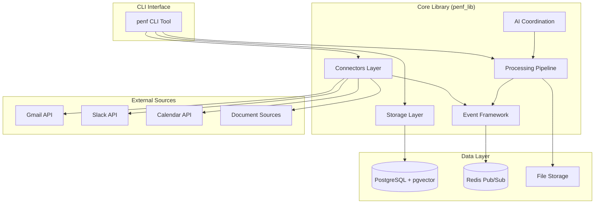
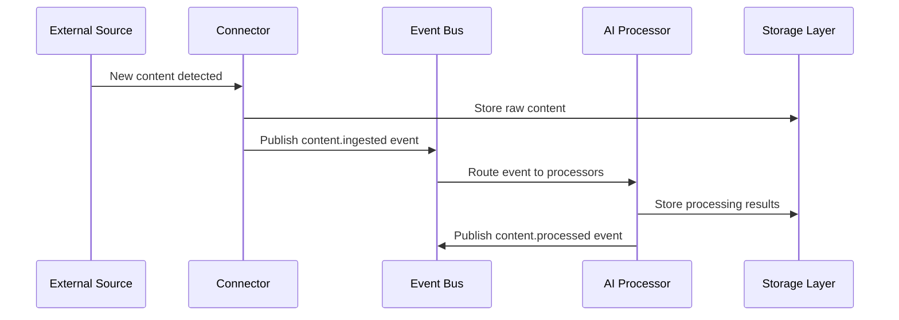
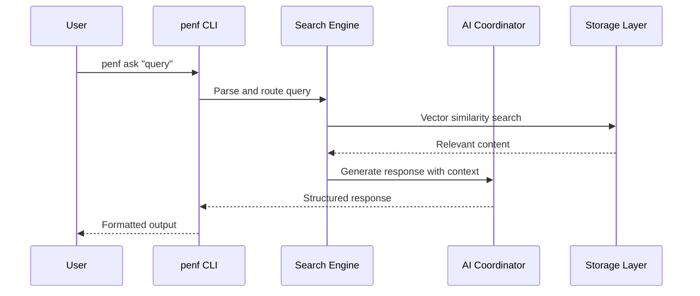
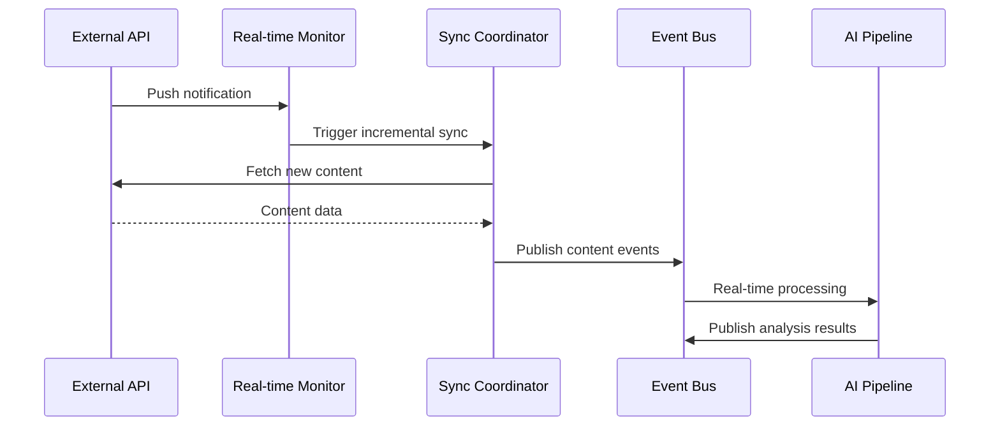
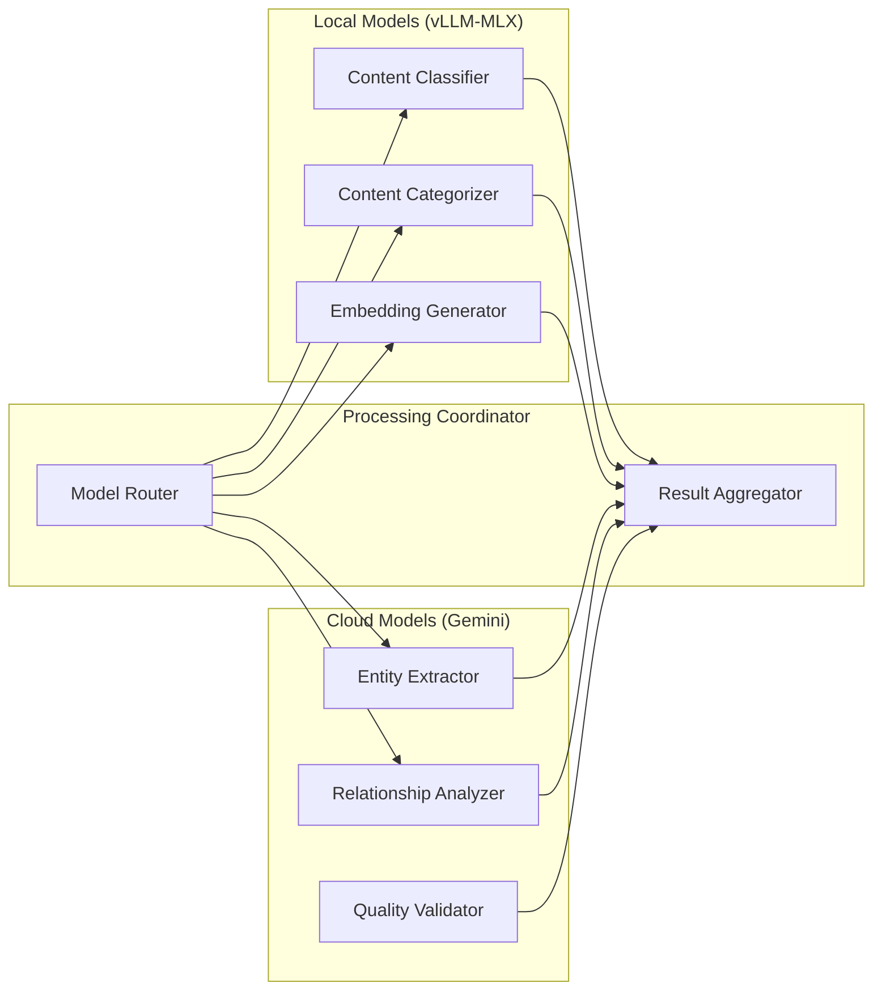

# Penfold System Architecture

> Detailed architectural documentation lives in Context Palace knowledge documents.
> Run `cxp knowledge list --doc-type architecture` to see all system docs.
> Key docs: `penfold-arch-pipeline`, `penfold-arch-data`, `penfold-arch-ingest`, `penfold-arch-enrichment`, `penfold-arch-infra`, `penfold-arch-search`

This document provides a comprehensive overview of Penfold's system architecture, including core principles, component design, data flows, and integration patterns.

## Table of Contents

- [Overview](#overview)
- [Core Principles](#core-principles)
- [System Components](#system-components)
- [Data Flow Architecture](#data-flow-architecture)
- [Integration Patterns](#integration-patterns)
- [Storage Layer](#storage-layer)
- [Event Processing Framework](#event-processing-framework)
- [AI Processing Pipeline](#ai-processing-pipeline)
- [Security Architecture](#security-architecture)
- [Performance and Scalability](#performance-and-scalability)
- [Deployment Architecture](#deployment-architecture)

## Overview

Penfold is a personal AI-powered information system that transforms fragmented organizational knowledge into a navigable, queryable institutional memory. The system aggregates, correlates, and surfaces contextual information from disparate communication channels (email, Slack, documents, meetings).

### Mental Model: Contextual Time Machine

Penfold operates on the principle of "temporal archaeology" - enabling users to:
- Rewind time to reconstruct context for any decision or conversation
- Navigate through project timelines with full context preservation
- Discover emergent relationships between people, projects, and decisions
- Query information as "what was happening when..." rather than "where did I store..."

## Core Principles

### 1. Temporal First Architecture

Time is the primary organizing axis for all information:
- Every piece of content has a precise timestamp
- Temporal queries are first-class operations
- Project timelines preserve chronological context
- Decision histories maintain audit trails

### 2. Event-Driven Processing

All system operations are event-driven:
- Content ingestion publishes `content.ingested` events
- AI processing triggered by event consumption
- Loose coupling between integration and processing
- Enables flexible multi-model AI coordination

### 3. Source Truth Preservation

Original content is immutable and always accessible:
- Raw content preserved with complete metadata
- Processing results linked back to source
- Attachment preservation with content extraction
- Audit trails for all transformations

### 4. Emergent Structure Discovery

AI discovers relationships rather than enforcing rigid schemas:
- Entity resolution across multiple sources
- Project context discovery through content analysis
- Relationship strength scoring through interaction patterns
- Dynamic categorization based on content similarity

### 5. Local-First with Cloud Quality Gates

Processing optimized for local development with selective cloud usage:
- Local models (vLLM-MLX) for classification and categorization
- Cloud models (Gemini) for complex extraction and validation
- Local vector storage and similarity search
- Privacy-preserving architecture with user control

## System Components

### Core Infrastructure



### Component Descriptions

#### Go Pipeline (`penfold-go-pipeline/`)
High-performance AI processing pipeline:
- **Pipeline Process**: Redis-to-Temporal bridge, starts workflows from events
- **Worker Process**: Executes workflow activities (embedding, LLM, storage)
- **Temporal Integration**: Workflow orchestration with persistence and visibility
- **Ollama**: Local embedding generation service (mxbai-embed-large)

Key packages:
- `cmd/pipeline/` - Event subscriber and workflow starter
- `cmd/worker/` - Temporal worker with activity registration
- `internal/workflows/` - Workflow definitions (EmailProcessingWorkflow)
- `internal/activities/` - Activity implementations
- `internal/temporal/` - Temporal client factory

#### CLI Tool (`penf`)
Main user interface providing:
- Content ingestion commands (`penf ingest`)
- Query interface (`penf ask "query"`)
- Review workflows (`penf review --daily`)
- Project management (`penf project <name>`)
- System configuration (`penf config`)

#### Connectors Layer (`penf_lib.connectors`)
Integration adapters for external systems:
- **Gmail Connector**: OAuth2 authentication, email sync, real-time monitoring
- **Slack Connector**: Bot integration, channel monitoring, message processing
- **Calendar Connector**: Event sync, meeting context extraction
- **Document Connector**: File ingestion, content extraction, version tracking

#### Event Framework (`penf_lib.events`)
Pub/sub infrastructure for system coordination:
- Redis-based message queue with PostgreSQL fallback
- Standardized event schemas across all integrations
- Event routing and filtering capabilities
- Retry logic and dead letter queue management

#### Processing Pipeline (`penf_lib.processing`)
Content analysis and transformation:
- Content classification and categorization
- Entity extraction and resolution
- Project context identification
- Relationship discovery and scoring

#### AI Coordination (`penf_lib.ai`)
Multi-model AI processing orchestration:
- Local model coordination (vLLM-MLX + Qwen2.5)
- Cloud model integration (Gemini API)
- Model selection based on task complexity
- Response validation and quality scoring

#### Automation Engine (`penf_lib.automation`)
Intelligent automation of content processing:
- **Confidence-Based Processing**: Auto-process high-confidence content (>85% default)
- **Rule Management**: User-defined rules with condition trees and versioning
- **Pattern Detection**: Detect recurring user behaviors for rule suggestions
- **Progressive Automation**: Self-adjusting thresholds based on accuracy
- **Effectiveness Monitoring**: Track rule performance and degradation
- **Conflict Resolution**: Confidence-weighted scoring for multi-rule matches

Key components:
- `AutomationEngine`: Core evaluation and decision-making
- `AutomationRepository`: Rule CRUD and decision tracking
- `PatternDetector`: User behavior pattern analysis
- `ProgressiveAutomation`: Threshold auto-adjustment
- `RuleMetrics`: Performance measurement

#### Storage Layer (`penf_lib.storage`)
Hybrid storage for structured and unstructured data:
- PostgreSQL for metadata, relationships, and structured data
- pgvector for semantic similarity search
- File system for attachment and document storage
- Migration system with Alembic

## Data Flow Architecture

### 1. Content Ingestion Flow



### 2. Query Processing Flow



### 3. Real-time Processing Flow



## Integration Patterns

### OAuth2 Authentication Pattern

Standardized across all external integrations:
- PKCE-enhanced OAuth2 flow for security
- AES-256 encrypted credential storage
- Automatic token refresh with fallback
- Multi-account support with isolation

```python
# Standard OAuth2 integration pattern
class OAuth2Manager:
    async def start_oauth_flow(self, account_id: str) -> AuthorizationURL
    async def complete_oauth_flow(self, account_id: str, auth_code: str) -> bool
    async def get_valid_token(self, account_id: str) -> Optional[AccessToken]
    async def refresh_token(self, account_id: str) -> Optional[AccessToken]
```

### Event Publishing Pattern

Consistent event structure across all integrations:

```python
@dataclass
class ContentIngestedEvent:
    event_type: str = "content.ingested"
    source_type: str  # "gmail", "slack", "calendar"
    source_id: str    # External system ID
    content: str
    metadata: Dict[str, Any]
    timestamp: datetime
    integration_metadata: Dict[str, Any]  # Source-specific data
```

### Privacy Filter Pattern

Configurable privacy controls applied uniformly:
- Label-based filtering
- Content pattern matching (regex)
- Domain and sender filtering
- Audit logging for compliance

### Multi-Account Management Pattern

Intelligent scheduling across multiple accounts:
- Priority-based resource allocation
- Activity-aware sync intervals
- Rate quota distribution
- Graceful degradation on quota exhaustion

## Storage Layer

### Database Schema Design

```sql
-- Core entities
CREATE TABLE sources (
    id UUID PRIMARY KEY,
    source_type VARCHAR(50) NOT NULL,
    external_id VARCHAR(255) NOT NULL,
    content TEXT NOT NULL,
    metadata JSONB,
    created_at TIMESTAMP DEFAULT NOW(),
    UNIQUE(source_type, external_id)
);

CREATE TABLE assertions (
    id UUID PRIMARY KEY,
    source_id UUID REFERENCES sources(id),
    assertion_type VARCHAR(100) NOT NULL,
    content TEXT NOT NULL,
    confidence_score FLOAT,
    metadata JSONB,
    created_at TIMESTAMP DEFAULT NOW()
);

CREATE TABLE people (
    id UUID PRIMARY KEY,
    canonical_name VARCHAR(255) NOT NULL,
    email_addresses TEXT[],
    aliases TEXT[],
    metadata JSONB,
    created_at TIMESTAMP DEFAULT NOW()
);

CREATE TABLE projects (
    id UUID PRIMARY KEY,
    name VARCHAR(255) NOT NULL,
    parent_id UUID REFERENCES projects(id),
    status VARCHAR(50),
    start_date DATE,
    end_date DATE,
    metadata JSONB,
    created_at TIMESTAMP DEFAULT NOW()
);

-- Vector storage for semantic search
CREATE TABLE content_embeddings (
    source_id UUID REFERENCES sources(id),
    embedding vector(768),  -- pgvector extension
    model_name VARCHAR(100),
    created_at TIMESTAMP DEFAULT NOW()
);

-- Create HNSW index for fast similarity search
CREATE INDEX content_embeddings_idx ON content_embeddings
USING hnsw (embedding vector_l2_ops) WITH (m = 16, ef_construction = 200);
```

### Integration-Specific Tables

Each integration adds specialized tables:

```sql
-- Gmail integration
CREATE TABLE gmail_connections (
    id UUID PRIMARY KEY,
    account_email VARCHAR(255) NOT NULL UNIQUE,
    encrypted_credentials BYTEA NOT NULL,
    status VARCHAR(50) DEFAULT 'active',
    last_refresh_at TIMESTAMP,
    created_at TIMESTAMP DEFAULT NOW()
);

CREATE TABLE sync_operations (
    id UUID PRIMARY KEY,
    account_id UUID REFERENCES gmail_connections(id),
    operation_type VARCHAR(50) NOT NULL,
    status VARCHAR(50) DEFAULT 'pending',
    progress JSONB,
    created_at TIMESTAMP DEFAULT NOW()
);
```

### Vector Storage Strategy

**Embedding Model**: mxbai-embed-large (1024 dimensions)
**Index Type**: HNSW with parameters:
- M = 16 (connectivity)
- ef_construction = 200 (search quality during index build)
- Distance function: L2 (Euclidean distance)

**Search Strategy**:
```python
async def similarity_search(
    query_embedding: List[float],
    limit: int = 20,
    threshold: float = 0.8
) -> List[SimilarContent]:
    query = """
    SELECT s.id, s.content, s.metadata,
           1 - (e.embedding <-> $1) as similarity
    FROM content_embeddings e
    JOIN sources s ON e.source_id = s.id
    WHERE 1 - (e.embedding <-> $1) > $2
    ORDER BY e.embedding <-> $1
    LIMIT $3
    """
    return await database.fetch_all(query, query_embedding, threshold, limit)
```

## Event Processing Framework

### Redis Pub/Sub Architecture

```python
# Event publishing
class EventPublisher:
    async def publish(self, event: BaseEvent) -> None:
        await redis.publish(f"events:{event.event_type}", event.to_json())

# Event consumption
class EventConsumer:
    async def subscribe(self, event_types: List[str], handler: EventHandler) -> None:
        for event_type in event_types:
            await redis.subscribe(f"events:{event_type}", handler)
```

### Event Processing Pipeline

1. **Content Ingestion Events** (`content.ingested`)
   - Published by connectors when new content is fetched
   - Triggers AI processing pipeline
   - Includes full content and metadata

2. **Processing Events** (`content.processing`, `content.processed`)
   - Track AI processing status
   - Enable monitoring and debugging
   - Support retry logic for failed processing

3. **Analysis Events** (`analysis.completed`)
   - Published after AI analysis completion
   - Contains extracted entities and relationships
   - Triggers indexing and storage updates

### PostgreSQL Fallback

For reliability, critical events are also stored in PostgreSQL:

```sql
CREATE TABLE event_log (
    id UUID PRIMARY KEY,
    event_type VARCHAR(100) NOT NULL,
    event_data JSONB NOT NULL,
    processed_at TIMESTAMP,
    retry_count INTEGER DEFAULT 0,
    created_at TIMESTAMP DEFAULT NOW()
);
```

## AI Processing Pipeline

### Go Pipeline with Temporal Orchestration

The AI processing pipeline is implemented in Go (`penfold-go-pipeline/`) with Temporal workflow orchestration for reliable, observable multi-step processing.

#### Architecture Overview

```
┌─────────────────────────────────────────────────────────────────────────────┐
│                           Temporal Server                                    │
│  ┌─────────────┐    ┌──────────────────┐    ┌─────────────────────────────┐ │
│  │ Task Queue  │───▶│ Email Processing │───▶│ Execution History           │ │
│  │ (persisted) │    │ Workflow         │    │ (full visibility)           │ │
│  └─────────────┘    └──────────────────┘    └─────────────────────────────┘ │
└─────────────────────────────────────────────────────────────────────────────┘
         ▲                     │
         │                     ▼
┌────────┴───────┐    ┌───────────────────────────────────────────────────────┐
│ Pipeline       │    │                    Activities                          │
│ (Redis bridge  │    │  ┌────────────┐  ┌────────────┐  ┌─────────────────┐  │
│  → Temporal)   │    │  │ Fetch      │  │ Generate   │  │ Generate        │  │
│                │    │  │ Source     │  │ Embedding  │  │ Summary         │  │
└────────────────┘    │  └────────────┘  └────────────┘  └─────────────────┘  │
                      │  ┌────────────┐  ┌─────────────────────────────────┐  │
                      │  │ Extract    │  │ Update                          │  │
                      │  │ Assertions │  │ Status                          │  │
                      │  └────────────┘  └─────────────────────────────────┘  │
                      └───────────────────────────────────────────────────────┘
                                         │
                      ┌──────────────────┼──────────────────┐
                      ▼                  ▼                  ▼
               MLX Sidecar          vLLM-MLX          PostgreSQL
               (embeddings)         (LLM)             (storage)
               :8001                :8000
```

#### Two-Process Architecture

1. **Pipeline Process** (`cmd/pipeline/main.go`)
   - Subscribes to Redis pub/sub events
   - Converts events to Temporal workflows
   - Lightweight, fast startup

2. **Worker Process** (`cmd/worker/main.go`)
   - Executes workflow activities
   - Handles retries and heartbeats
   - Manages concurrent LLM calls

#### Why Temporal?

| Problem with Redis Pub/Sub | Temporal Solution |
|---------------------------|-------------------|
| Messages dropped when buffer full | Task queue with persistence |
| No visibility into processing state | Full execution history in Web UI |
| Manual retry/circuit breaker logic | Built-in retry policies |
| No dead letter handling | Failed workflows visible & retryable |
| Difficult to add preprocessing steps | Workflows as code - easy to extend |

#### EmailProcessingWorkflow

Sequential activity execution with per-activity retry policies:

1. **FetchSource** - Retrieve content from PostgreSQL (fast, 3 retries)
2. **GenerateEmbedding** - MLX sidecar, 1-5 seconds (3 retries)
3. **GenerateSummary** - vLLM-MLX, 30-60 seconds (2 retries, heartbeat)
4. **ExtractAssertions** - vLLM-MLX, 30-60 seconds (2 retries, heartbeat)
5. **UpdateSourceStatus** - Mark processing complete (3 retries)

### Multi-Model Architecture



### Processing Stages

1. **Embedding Generation** (Local - Ollama mxbai-embed-large)
   - 1024-dimensional content vectors
   - Similarity search enablement
   - Clustering and topic discovery

2. **Classification** (Cloud - Gemini)
   - Content type identification
   - Urgency scoring
   - Basic categorization

3. **Entity Extraction** (Cloud - Gemini)
   - Person, project, decision identification
   - Date and milestone extraction
   - Complex relationship parsing

4. **Quality Validation** (Cloud - Gemini)
   - Extraction accuracy verification
   - Confidence scoring
   - Inconsistency detection

### Model Selection Strategy

```python
class ModelRouter:
    def select_model(self, task: ProcessingTask) -> ModelConfig:
        if task.task_type == "embedding":
            return LocalModelConfig("ollama/mxbai-embed-large")
        elif task.requires_accuracy_validation:
            return CloudModelConfig("gemini-pro")
        else:
            return CloudModelConfig("gemini-flash")
```

## Security Architecture

### Authentication and Authorization

- **OAuth2 PKCE**: Enhanced security for public clients
- **Credential Encryption**: AES-256-GCM at rest
- **Token Management**: Automatic refresh with secure storage
- **Multi-Account Isolation**: Separate credential stores

### Privacy Controls

- **Content Filtering**: Regex and label-based exclusion
- **Data Minimization**: Configurable retention periods
- **Audit Logging**: Complete audit trail for compliance
- **Local Processing**: Sensitive content processed locally

### Network Security

- **TLS 1.3**: All external communications encrypted
- **Certificate Pinning**: Gmail API certificate validation
- **Request Signing**: Webhook signature verification
- **Rate Limiting**: Protection against abuse

## Performance and Scalability

### Performance Targets

- **Content Ingestion**: 100+ items/minute per source
- **Real-time Processing**: <60 seconds detection latency
- **Vector Search**: <500ms for 100K vectors
- **Concurrent Operations**: 50+ simultaneous connections
- **Database Operations**: <100ms for standard CRUD

### Scalability Strategies

#### Horizontal Scaling
- **Connection Pooling**: Multiple database connections
- **Background Processing**: Celery worker scaling
- **Cache Layers**: Redis for frequently accessed data

#### Vertical Optimization
- **Index Tuning**: HNSW parameters optimized for dataset size
- **Query Optimization**: Prepared statements and query planning
- **Memory Management**: Streaming for large content processing

#### Resource Management
```python
# Connection pool configuration
DATABASE_CONFIG = {
    'pool_size': 20,
    'max_overflow': 30,
    'pool_timeout': 30,
    'pool_recycle': 3600
}

# Background processing
CELERY_CONFIG = {
    'worker_concurrency': 4,
    'worker_prefetch_multiplier': 2,
    'task_acks_late': True,
    'task_reject_on_worker_lost': True
}
```

## Deployment Architecture

### Development Environment
- **Platform**: Mac Mini M4 (32GB RAM)
- **Database**: PostgreSQL 16+ with pgvector (dev02:5432)
- **Queue**: Redis 7+ (dev02:6379)
- **Temporal**: Temporal Server with PostgreSQL backend (localhost:7233, UI at :8088)
- **Local AI**: Ollama with mxbai-embed-large (:11434)
- **Python**: 3.12 with async/await
- **Go**: 1.22+ for pipeline services

### Production Considerations

#### Infrastructure Requirements
- **CPU**: Multi-core for concurrent processing
- **Memory**: 16GB+ for model loading and vector operations
- **Storage**: SSD for database performance
- **Network**: Stable connection for external API calls

#### Monitoring and Observability
- **Metrics**: Prometheus-compatible metrics export
- **Logging**: Structured JSON logging with correlation IDs
- **Tracing**: Distributed tracing for request flows
- **Health Checks**: Endpoint monitoring and alerting

#### Backup and Recovery
- **Database Backups**: Automated PostgreSQL backups
- **Configuration Backups**: Git-based configuration management
- **Credential Recovery**: Secure credential backup procedures
- **Disaster Recovery**: Complete system restoration procedures

This architecture provides a robust foundation for personal knowledge management while maintaining privacy, performance, and extensibility. The design enables organic growth from single-user operation to team-scale deployment while preserving the core principles of temporal archaeology and contextual intelligence.