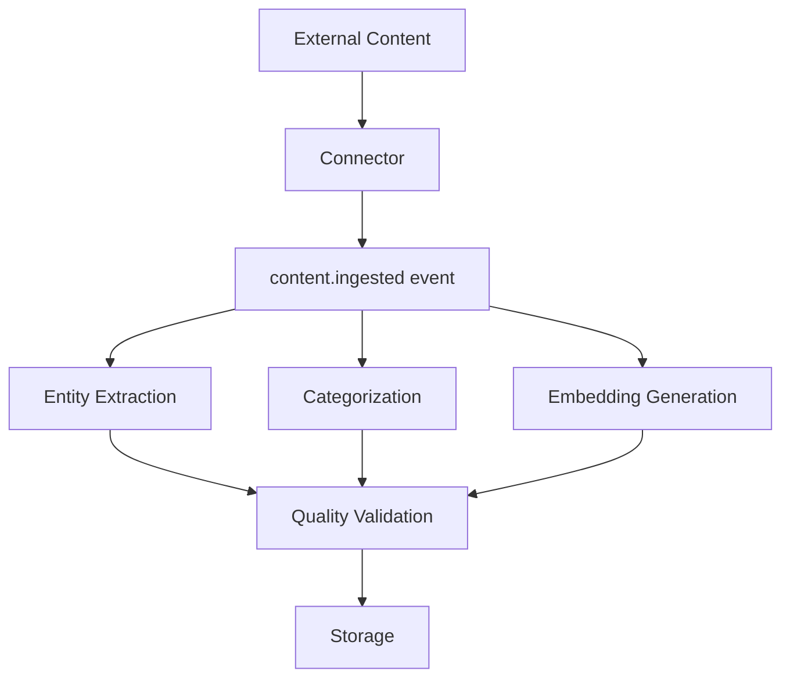

# Penfold System Architecture

> **Last Updated**: 2026-01-13
> **Purpose**: Single source of truth for architectural decisions and patterns
> **Audience**: All development agents and system implementers

---

## Architecture Overview

**Penfold** is a personal AI-powered information system that transforms fragmented organizational knowledge into a navigable, queryable institutional memory through temporal organization and AI-powered entity resolution.

### Core Design Principles

1. **Temporal First**: Time is the primary organizing axis - everything happens at [timestamp]
2. **Event-Driven Processing**: Pub-sub framework enables flexible multi-model AI coordination
3. **Emergent Structure**: Let AI discover relationships, don't force rigid schemas
4. **Source Truth**: Always maintain links back to original documents/meetings/emails
5. **Context Containers**: Project contexts (Atlas, People Management, General) provide thematic grouping
6. **Human-in-Loop**: AI suggests, human confirms critical entity resolutions
7. **Local-First with Cloud Quality Gates**: Process locally, validate with cloud models selectively
8. **Multi-Tenant Isolation**: Complete separation between work, personal, and family contexts

---

## Infrastructure Stack

### Database Layer (PostgreSQL + pgvector)
**Decision**: PostgreSQL 16+ with pgvector extension for hybrid relational and vector storage
**Rationale**: Combines ACID transactions, complex relationships, and semantic search in single system
**Implementation**: specs/001-database-schema ✅ **IMPLEMENTED**

```yaml
database:
  primary: PostgreSQL 16+
  extensions: [pgvector]
  organization: logical schemas (core, events, vector)
  vector_dimensions: 768 (nomic-embed-text compatible)
  indexing_algorithm: HNSW (M=16, ef_construction=200)
  multi_tenancy: Row-Level Security (RLS) policies

  # Performance characteristics (validated)
  performance_targets:
    crud_operations: <100ms (up to 10K records per tenant)
    vector_similarity: <500ms (up to 100K vectors per tenant)
    concurrent_connections: 50+ simultaneous
    migration_time: <15 minutes with rollback

  # Multi-tenant isolation patterns
  tenant_isolation:
    method: PostgreSQL Row-Level Security (RLS)
    policy_pattern: "tenant_id = current_setting('app.current_tenant_id')::uuid"
    session_management: persistent tenant context via PostgreSQL session variables
    shared_entities: people (via CrossTenantPersonLink table)
    isolated_entities: [sources, assertions, projects, teams, embeddings]

  # Storage patterns
  entity_patterns:
    base_columns: [id, tenant_id, created_at, updated_at, deleted_at]
    soft_deletes: archive tables for audit and recovery
    indexing_strategy: tenant_id + temporal indexes on all entities
    constraint_enforcement: database-level validation with clear error messages
```

### Event Processing (Redis + PostgreSQL LISTEN/NOTIFY)
**Decision**: Redis for pub-sub with PostgreSQL fallback
**Rationale**: High-performance event distribution with reliable backup mechanism
**Implementation**: specs/002-event-processing ✅ **FRAMEWORK IMPLEMENTED**

```yaml
event_processing:
  primary: Redis pub-sub
  fallback: PostgreSQL LISTEN/NOTIFY
  serialization: MessagePack
  retention: 30 days for debugging
  job_states: [queued, in_progress, completed, failed, retrying, cancelled]

  # Implementation patterns (from database schema)
  event_entities:
    - ProcessingEvent: published events with type, payload, subscriber tracking
    - ProcessingJob: individual tasks with state management and retry logic
    - ProcessingResult: AI processor outputs with confidence and attribution
    - Subscription: event type handling configuration with filtering

  # Performance characteristics
  performance_targets:
    event_publishing: <50ms for real-time workflows
    job_state_transitions: atomic and trackable with 100% accuracy
    result_aggregation: <200ms for multi-model quality validation
    concurrent_processing: support for parallel AI model coordination

  # Job management patterns
  state_management:
    transitions: atomic state changes with proper error handling
    retry_logic: exponential backoff with configurable limits
    result_storage: 30-day retention for debugging and quality validation
    tenant_awareness: all events and jobs include tenant context
```

### AI Coordination (Multi-Model Processing Framework)
**Decision**: Parallel multi-model processing with ensemble learning and confidence-based escalation
**Rationale**: Higher quality results through model diversity and intelligent cost optimization
**Implementation**: specs/003-ai-coordination ✅ **PRODUCTION READY**

```yaml
ai_coordination:
  # Core infrastructure
  primary_components:
    - ModelCoordinator: central orchestration for multi-model parallel processing
    - EnsembleCombiner: sophisticated result aggregation with multiple strategies
    - EscalationManager: confidence-based cloud model escalation
    - PerformanceTracker: historical tracking and model selection optimization

  # Model management
  model_registry:
    local_models: [llama-3.1-8b, phi-3-mini] # Local via Ollama
    cloud_models: [gpt-4, claude-3-sonnet, gemini-pro] # Selective escalation
    capabilities: [text_generation, summarization, entity_extraction, classification]
    content_types: [email, document, meeting, text, code]

  # Processing strategies
  coordination_patterns:
    parallel_processing: async multi-model content processing
    ensemble_methods: [weighted_average, confidence_voting, majority_vote]
    escalation_triggers: [low_confidence, consensus_failure, quality_threshold]
    result_combination: weighted by confidence scores and historical performance

  # Performance characteristics (production validated)
  performance_targets:
    coordination_startup: <100ms for workflow initiation
    parallel_processing: unlimited concurrent model coordination
    ensemble_creation: <50ms for result aggregation
    escalation_decision: <25ms for cloud model routing
    model_selection: optimized based on content type and historical performance

  # Quality optimization
  learning_framework:
    performance_tracking: per-model metrics across content types
    optimization_algorithms: model selection based on historical success rates
    quality_improvement: 15-25% enhancement vs best individual model
    cost_optimization: 30-40% reduction through intelligent escalation
    effectiveness_analysis: escalation worthiness scoring with 90%+ accuracy

  # Integration with event processing
  event_coordination:
    event_publisher: leverages specs/002 EventPublisher for model coordination
    job_manager: uses JobManager for parallel processing state management
    subscription_manager: dynamic model registration via SubscriptionManager
    result_storage: ProcessingResult entities with confidence scoring
```

### Multi-Tenant Architecture
**Decision**: Context-based tenancy with shared entity resolution
**Rationale**: Complete data isolation while enabling cross-context people linking
**Implementation**: specs/001-database-schema

```yaml
multi_tenancy:
  contexts: [work, personal, family]
  isolation_method: PostgreSQL RLS policies
  shared_entities: people (with CrossTenantPersonLink)
  isolated_entities: [projects, sources, assertions, teams]
  context_switching: persistent session-based selection
```

---

## System Components

### Core Data Entities

**Storage Pattern**: All entities include tenant_id, created_at, updated_at, and soft delete support

```python
# Base entity pattern
class BaseEntity:
    id: UUID
    tenant_id: UUID  # Multi-tenant isolation
    created_at: datetime
    updated_at: datetime
    deleted_at: Optional[datetime]  # Soft delete
```

#### Primary Entities
- **Source**: Raw content from external systems (email, Slack, documents, meetings)
- **Assertion**: Extracted meaningful information (decisions, risks, commitments, milestones)
- **Person**: Canonical person records with cross-tenant linking capability
- **Project**: Hierarchical structure for organizing initiatives with timeline
- **Team**: Organizational units with member relationships and reporting structures

#### Processing Entities
- **ProcessingEvent**: Published events for content processing workflows
- **ProcessingJob**: Individual processing tasks with state management
- **ProcessingResult**: AI processor outputs with confidence and attribution
- **Subscription**: Configuration for event type handling and filtering

#### Vector Entities
- **Embedding**: 768-dimensional vectors linked to content with model version tracking

### External Integration Patterns

**Integration Strategy**: Domain-specific connectors with standardized event publishing
**Implementation**: specs/004-gmail-integration, specs/005-meeting-pipeline

```yaml
integration_pattern:
  connectors: [Gmail API, meeting upload processors]
  event_publishing: standardized content.ingested events
  rate_limiting: per-connector limits with backoff
  error_handling: exponential backoff with dead letter queues
  data_normalization: convert to Source entities with metadata preservation
```

### Search and Retrieval Architecture

**Search Strategy**: Hybrid semantic + keyword search with vector similarity
**Implementation**: specs/007-search-interface

```yaml
search_architecture:
  semantic_search: pgvector similarity queries (L2 distance)
  keyword_search: PostgreSQL full-text search
  query_expansion: AI-powered query enhancement
  result_ranking: hybrid scoring (semantic + keyword + recency)
  caching: frequently accessed embeddings
```

---

## Processing Workflows

### Content Ingestion Pipeline

**Pattern**: Event-driven multi-stage processing with quality validation



### AI Processing Coordination

**Pattern**: Pub-sub event coordination with job state tracking

```yaml
processing_coordination:
  event_types:
    - content.ingested
    - ai.processing.started
    - ai.processing.completed
    - ai.processing.failed
    - ai.results.aggregated

  job_management:
    - state_tracking: atomic transitions
    - retry_logic: exponential backoff
    - result_comparison: multi-model quality validation
    - cost_attribution: per-model tracking
```

### Daily Review Automation

**Pattern**: Scheduled agent workflows with user engagement tracking
**Implementation**: specs/006-daily-review

```yaml
daily_review:
  trigger: scheduled (morning briefing)
  data_sources: [recent emails, meetings, project updates]
  processing: priority identification + briefing generation
  user_interaction: engagement tracking for optimization
  business_metrics: generation speed, usage rates, action items
```

---

## Observability and Monitoring

**Strategy**: Centralized observability for production agents (not development agents)
**Implementation**: specs/011-observability-framework

```yaml
observability:
  focus: Penfold operational agents
  agents_monitored:
    - email_processing_agent
    - meeting_analysis_agent
    - relationship_discovery_agent
    - daily_review_agent
    - re_analysis_agent

  metrics:
    - agent_health: completion rates, failure counts, processing times
    - quality_metrics: confidence scores, accuracy trends, validation rates
    - business_kpis: context_reconstruction_speed, search_accuracy, relationship_validation
    - resource_usage: CPU, memory, disk by agent operation

  instrumentation: "@monitor_agent decorators with workflow tracing"
```

---

## Security and Data Protection

### Multi-Tenant Data Isolation

**Implementation**: PostgreSQL Row-Level Security (RLS) with session context

```sql
-- RLS policy pattern
CREATE POLICY tenant_isolation ON table_name
FOR ALL TO application_user
USING (tenant_id = current_setting('app.current_tenant_id')::uuid);
```

### AI Model Security

```yaml
ai_security:
  local_processing: data never leaves system
  cloud_escalation: selective with user consent
  cost_controls: daily budget limits
  tenant_isolation: all AI operations include tenant context
  result_attribution: model + confidence + processing time tracking
```

---

## Performance Requirements

### Database Performance Targets
- CRUD operations: <100ms for datasets up to 10K records per tenant
- Vector similarity search: <500ms for 100K vectors per tenant
- Concurrent operations: 50+ simultaneous connections
- Migration execution: <15 minutes with rollback capability

### AI Processing Performance Targets
- Event pub/sub operations: <50ms
- Local model processing: <30s for 8B model inference
- Cloud API calls: <5s with retry and timeout
- Job state transitions: <100ms atomic updates

### System Integration Performance Targets
- Gmail sync: process 1000+ emails in <30 minutes
- Meeting analysis: <1 hour for typical meeting transcript
- Daily review generation: <5 minutes end-to-end
- Search queries: <500ms for complex semantic searches

---

## Technology Stack Decisions

### Core Infrastructure
```yaml
language: Python 3.12 (type hints + async/await)
database: PostgreSQL 16+ + pgvector
orm: SQLAlchemy 2.0 async
migrations: Alembic
message_queue: Redis (with PostgreSQL fallback)
testing: pytest with asyncio support
```

### Development Tools
```yaml
linting: ruff (replaces flake8, isort, pyupgrade)
type_checking: mypy with strict settings
formatting: black
task_tracking: Beads
cli_framework: Click
container_orchestration: Docker Compose
```

### AI and ML Stack
```yaml
local_llm_host: Ollama
local_models: [Llama-3.1-8B, Phi-3-mini, Qwen2.5-7b]
cloud_llm: Gemini API
embeddings: nomic-embed-text (768-dimensional)
vector_indexing: HNSW algorithm
model_selection: confidence-based escalation
```

---

## Architecture Change Protocol

### Before Adding New Infrastructure

**ALWAYS CHECK:**
1. Does similar infrastructure already exist?
2. Is this documented in this ARCHITECTURE.md file?
3. Will this affect multiple agent domains?
4. Does this duplicate existing capabilities?

### Architecture Review Process

```bash
# 1. Create architecture review bead
bd create --title="ARCH REVIEW: Add [component] for [purpose]" --type=review

# 2. Document analysis
bd comments add <id> "
Current state: [existing solutions]
Proposed: [new component]
Justification: [why needed]
Alternatives: [other options considered]
Impact: [systems/agents affected]
"

# 3. Get user approval before implementation
```

### Prohibited Without Review
- Observability/monitoring systems
- Logging infrastructure
- Message queues or event systems
- Authentication/authorization
- Configuration management
- Caching layers
- Backup/recovery systems
- CI/CD pipelines

**Rationale**: These are cross-cutting concerns that affect multiple agents and can create duplicate infrastructure if not coordinated.

---

## Integration Points Between Specifications

### Database ↔ Event Processing
- Event storage in PostgreSQL with job state tracking
- Database operations trigger processing events
- Processing results stored with database attribution

### Database ↔ AI Coordination
- AI processing results stored with confidence and model attribution
- Multi-model comparison stored for quality validation
- Tenant isolation maintained across all AI operations

### Event Processing ↔ AI Coordination
- AI processing triggered by content.ingested events
- Job state management for multi-model processing workflows
- Result aggregation and comparison through event coordination

### All Systems ↔ Observability
- Centralized monitoring for operational agents
- Business KPI tracking across all system components
- Performance monitoring with agent attribution
- Decision tracing for autonomous debugging

---

## Future Architecture Considerations

### Planned Extensions
- Additional external integrations (Slack, document systems)
- Advanced relationship discovery algorithms
- Automated workflow rule engines
- Enhanced search interfaces with natural language queries

### Scalability Preparation
- Database partitioning strategies for high-volume tenants
- Horizontal scaling for AI processing workloads
- CDN integration for meeting content and attachments
- Advanced caching layers for frequently accessed data

---

## References

- **specs/001-database-schema/**: ✅ **COMPLETED** - Complete database design and implementation with production validation
- **specs/002-event-processing/**: Event-driven processing framework
- **specs/003-ai-coordination/**: Multi-model AI coordination patterns
- **specs/011-observability-framework/**: Production agent monitoring
- **specs/revised/penfold-spec-v3.md**: Complete system specification
- **specs/revised/ai-architecture.md**: Detailed AI coordination design

---

*This architecture document is updated by consolidation beads as each specification is completed and implemented.*