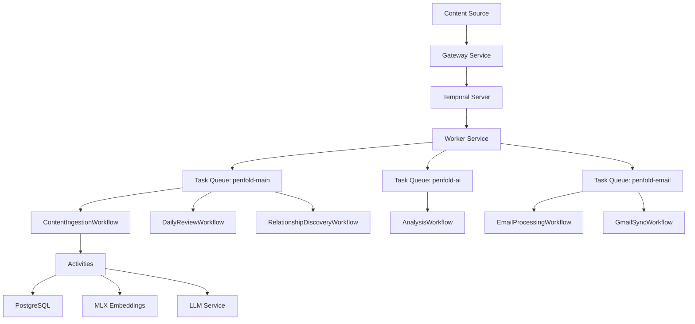

# Event Processing Framework - User Guide

**Status**: Production Ready
**Version**: 2.0 (Go/Temporal)
**Implementation**: services/worker/workflows/, services/worker/activities/

## Overview

The Event Processing Framework provides a production-ready, scalable system for coordinating AI model processing through Temporal-based workflow orchestration. It enables durable execution of content ingestion, multi-model AI coordination, and result aggregation across local and cloud processors.

## Key Features

### Production Components
- **Temporal Workflows**: Durable, fault-tolerant workflow orchestration
- **Activity System**: Reusable, retryable units of work
- **Task Queues**: Specialized queues for different workload types
- **Saga Pattern**: Automatic compensation for partial failures
- **Signal/Query Support**: Real-time workflow control and status

### Performance Characteristics
- **Durable execution** with automatic recovery from failures
- **Parallel activity execution** where dependencies allow
- **Configurable retry policies** per activity type
- **Heartbeat monitoring** for long-running operations
- **Multi-queue architecture** for workload isolation

## Architecture



## Getting Started

### 1. Workflow Execution

Start workflows through the Temporal client:

```go
package main

import (
    "context"
    "log"
    "time"

    "go.temporal.io/sdk/client"
    "github.com/otherjamesbrown/penfold/pkg/temporal"
)

func main() {
    // Create Temporal client
    c, err := client.Dial(client.Options{
        HostPort:  "localhost:7233",
        Namespace: "default",
    })
    if err != nil {
        log.Fatal(err)
    }
    defer c.Close()

    // Start content ingestion workflow
    workflowOptions := client.StartWorkflowOptions{
        ID:        "content-ingestion-123",
        TaskQueue: "penfold-main",
    }

    input := temporal.ContentIngestionInput{
        TenantID:    "tenant-001",
        SourceID:    12345,
        SourceType:  "email",
        ContentHash: "abc123",
        JobID:       "job-001",
    }

    we, err := c.ExecuteWorkflow(context.Background(), workflowOptions, "ContentIngestionWorkflow", input)
    if err != nil {
        log.Fatal(err)
    }

    log.Printf("Started workflow: %s, RunID: %s", we.GetID(), we.GetRunID())

    // Wait for result
    var result temporal.ContentIngestionResult
    if err := we.Get(context.Background(), &result); err != nil {
        log.Fatal(err)
    }

    log.Printf("Workflow completed: status=%s, embedding_id=%v", result.Status, result.EmbeddingID)
}
```

### 2. Activity Implementation

Activities are the units of work that perform actual operations:

```go
package activities

import (
    "context"
    "fmt"

    "go.temporal.io/sdk/activity"
)

// FetchContentInput is the input for the FetchContent activity.
type FetchContentInput struct {
    TenantID string `json:"tenant_id"`
    SourceID int64  `json:"source_id"`
}

// FetchContentOutput is the output from the FetchContent activity.
type FetchContentOutput struct {
    Content     string `json:"content"`
    ContentType string `json:"content_type"`
    Size        int64  `json:"size"`
}

// FetchContent retrieves content from the database.
func (a *Activities) FetchContent(ctx context.Context, input FetchContentInput) (*FetchContentOutput, error) {
    logger := activity.GetLogger(ctx)
    logger.Info("Fetching content", "source_id", input.SourceID)

    // Record heartbeat for long operations
    activity.RecordHeartbeat(ctx, "fetching content")

    // Perform database query
    query := `SELECT raw_content, content_type FROM sources WHERE id = $1 AND tenant_id = $2`
    var content, contentType string
    err := a.db.QueryRow(ctx, query, input.SourceID, input.TenantID).Scan(&content, &contentType)
    if err != nil {
        return nil, fmt.Errorf("failed to fetch source: %w", err)
    }

    return &FetchContentOutput{
        Content:     content,
        ContentType: contentType,
        Size:        int64(len(content)),
    }, nil
}
```

### 3. Workflow Query and Signals

Monitor and control running workflows:

```go
package main

import (
    "context"
    "log"

    "go.temporal.io/sdk/client"
    "github.com/otherjamesbrown/penfold/pkg/temporal"
)

func main() {
    c, _ := client.Dial(client.Options{HostPort: "localhost:7233"})
    defer c.Close()

    workflowID := "content-ingestion-123"

    // Query workflow status
    resp, err := c.QueryWorkflow(context.Background(), workflowID, "", "content_ingestion_status")
    if err != nil {
        log.Fatal(err)
    }

    var status temporal.WorkflowStatus
    if err := resp.Get(&status); err != nil {
        log.Fatal(err)
    }

    log.Printf("Workflow status: stage=%s, steps=%d/%d",
        status.Stage, status.StepsCompleted, status.TotalSteps)

    // Send cancellation signal with compensation
    signal := temporal.CancelWithCompensationSignal{
        Reason: "User requested cancellation",
    }
    err = c.SignalWorkflow(context.Background(), workflowID, "", "content_ingestion_cancel", signal)
    if err != nil {
        log.Fatal(err)
    }
}
```

## Workflow Types

### ContentIngestionWorkflow

Orchestrates content processing through multiple AI operations:

| Step | Activity | Description | Options |
|------|----------|-------------|---------|
| 1 | FetchContent | Retrieve content from storage | FastActivityOptions |
| 2 | GenerateEmbedding | Generate vector embedding (MLX) | EmbeddingActivityOptions |
| 3 | GenerateSummary | LLM-based summarization | LLMActivityOptions |
| 4 | ExtractEntities | Extract named entities | LLMActivityOptions |
| 5 | ExtractTopics | Extract topic keywords | LLMActivityOptions |
| 6 | ExtractMentions | Extract and resolve mentions | LLMActivityOptions |
| 7 | UpdateContentStatus | Mark processing complete | FastActivityOptions |

**Features:**
- Saga pattern with compensation for rollback
- Query handler for real-time status
- Signal handlers for priority updates and cancellation

### EmailProcessingWorkflow

Specialized workflow for email content:

| Step | Activity | Description |
|------|----------|-------------|
| 1 | FetchSource | Retrieve email from database |
| 2 | GenerateEmbedding | Generate searchable embedding |
| 3 | GenerateSummary | Create email summary |
| 4 | ExtractAssertions | Extract claims and facts |
| 5 | UpdateSourceStatus | Mark email as processed |

### DailyReviewWorkflow

Generates daily review summaries:

| Step | Activity | Description |
|------|----------|-------------|
| 1-3 | GatherItems | Parallel collection of emails, documents, assertions |
| 4 | PrioritizeReviewItems | AI-based prioritization |
| 5 | GenerateReviewSummary | LLM summary generation |
| 6 | SaveDailyReview | Persist review to database |

**Features:**
- Parallel activity execution for gathering
- Pause/resume signal support
- Graceful cancellation handling

### GmailSyncWorkflow

Synchronizes Gmail messages:

| Mode | Description |
|------|-------------|
| incremental | Sync only new messages since last sync |
| full | Full mailbox synchronization |

## Task Queues

Penfold uses specialized task queues for workload isolation:

| Queue | Name | Purpose |
|-------|------|---------|
| Main | `penfold-main` | General workflows, content ingestion |
| AI | `penfold-ai` | AI-intensive operations (embeddings, LLM) |
| Email | `penfold-email` | Email processing workflows |

Configure which queues a worker polls:

```bash
# Poll specific queues
export WORKER_TASK_QUEUES="penfold-main,penfold-ai"

# Poll all queues (default)
export WORKER_TASK_QUEUES="penfold-main,penfold-ai,penfold-email"
```

## Activity Options

Pre-configured activity options ensure consistent behavior:

### FastActivityOptions
For quick database operations:
- **Timeout**: 30 seconds
- **Retries**: 3 (1s, 2s, 4s backoff)
- **Heartbeat**: None

### EmbeddingActivityOptions
For local MLX embedding generation:
- **Timeout**: 30 seconds
- **Retries**: 3 (2s, 4s, 8s backoff)
- **Heartbeat**: 10 seconds

### LLMActivityOptions
For cloud LLM API calls:
- **Start-to-close timeout**: 2 minutes
- **Schedule-to-close timeout**: 5 minutes
- **Retries**: 2 (expensive operations)
- **Heartbeat**: 15 seconds

### BatchActivityOptions
For batch processing operations:
- **Timeout**: 5 minutes
- **Retries**: 2
- **Heartbeat**: 30 seconds

```go
import pkgtemporal "github.com/otherjamesbrown/penfold/pkg/temporal"

// Use preset options in workflows
fastOpts := pkgtemporal.FastActivityOptions()
llmOpts := pkgtemporal.LLMActivityOptions()

// Add non-retryable errors
llmOpts = pkgtemporal.WithNonRetryableErrors(llmOpts, pkgtemporal.NonRetryableErrors()...)
```

## Workflow Status

All workflows support status queries:

```go
type WorkflowStatus struct {
    Stage           string    `json:"stage"`
    StepsCompleted  int       `json:"steps_completed"`
    TotalSteps      int       `json:"total_steps"`
    LastActivity    string    `json:"last_activity"`
    StartedAt       time.Time `json:"started_at"`
    LastUpdated     time.Time `json:"last_updated"`
    ErrorMessage    string    `json:"error_message,omitempty"`
    CompensationRan bool      `json:"compensation_ran"`
}
```

Query names by workflow:
- `ContentIngestionWorkflow`: `content_ingestion_status`
- `DailyReviewWorkflow`: `daily_review_status`

## Signals

### Priority Update Signal
```go
signal := pkgtemporal.PriorityUpdateSignal{
    NewPriority: 2,
    Reason:      "Urgent processing required",
}
client.SignalWorkflow(ctx, workflowID, "", "content_ingestion_priority", signal)
```

### Pause/Resume Signal
```go
signal := pkgtemporal.PauseResumeSignal{
    Paused: true,
    Reason: "Manual review required",
}
client.SignalWorkflow(ctx, workflowID, "", "daily_review_pause", signal)
```

### Cancel with Compensation Signal
```go
signal := pkgtemporal.CancelWithCompensationSignal{
    Reason: "User requested cancellation",
}
client.SignalWorkflow(ctx, workflowID, "", "content_ingestion_cancel", signal)
```

## Configuration

### Worker Configuration

```bash
# Service identity
export WORKER_SERVICE_NAME="penfold-worker"
export WORKER_HTTP_PORT=8085
export WORKER_ENVIRONMENT="dev"  # dev, staging, prod

# Temporal connection
export TEMPORAL_HOST_PORT="localhost:7233"
export TEMPORAL_NAMESPACE="default"

# Task queues
export WORKER_TASK_QUEUES="penfold-main,penfold-ai,penfold-email"

# Concurrency
export WORKER_MAX_CONCURRENT_ACTIVITIES=10
export WORKER_MAX_CONCURRENT_WORKFLOWS=10

# Graceful shutdown
export WORKER_GRACEFUL_SHUTDOWN_TIMEOUT=30

# Logging
export WORKER_LOG_LEVEL="info"  # debug, info, warn, error

# Dependencies
export DATABASE_URL="postgres://..."
export AI_SERVICE_URL="http://localhost:8081"
```

### Non-Retryable Errors

These error types are not retried:
- `ValidationError` - Invalid input data
- `NotFoundError` - Resource not found
- `PermissionDeniedError` - Access denied
- `InvalidArgumentError` - Bad argument

## Troubleshooting

### Workflow Stuck in Running State

```bash
# Check workflow status via tctl
tctl workflow describe -w <workflow-id>

# View pending activities
tctl workflow describe -w <workflow-id> --print_raw_query

# Cancel workflow if necessary
tctl workflow cancel -w <workflow-id>
```

### Activity Timeouts

If activities consistently timeout:
1. Check heartbeat recording in activity code
2. Increase timeout in activity options
3. Verify external service availability (MLX, LLM)

```go
// Ensure heartbeats are recorded for long operations
func (a *Activities) LongOperation(ctx context.Context, input Input) error {
    for i := 0; i < 100; i++ {
        activity.RecordHeartbeat(ctx, fmt.Sprintf("processing %d/100", i))
        // ... do work ...
    }
    return nil
}
```

### Compensation Failures

If compensation activities fail:
1. Check worker logs for compensation errors
2. Manually clean up partial state if needed
3. Compensation failures are logged but don't fail the workflow

## Production Deployment

### Infrastructure Requirements
- **Temporal Server**: Self-hosted or Temporal Cloud
- **PostgreSQL 16+**: With pgvector extension
- **MLX Embeddings**: Local service on port 8081 (Apple Silicon)
- **Go 1.22+**: Runtime environment

### Scaling Recommendations
- **Horizontal scaling**: Deploy multiple worker instances
- **Queue isolation**: Separate workers for AI vs general workloads
- **Activity concurrency**: Tune based on available resources
- **Workflow history**: Configure Temporal retention policy

### Security Considerations
- **Tenant isolation**: All data includes tenant_id
- **Input validation**: Activities validate inputs
- **Connection security**: Use TLS for Temporal and database
- **Secrets management**: Use environment variables for credentials

---

## Next Steps

1. **Deploy worker service** with appropriate task queue configuration
2. **Configure Temporal** connection and namespace
3. **Start workflows** through the Gateway service
4. **Monitor execution** via Temporal Web UI or tctl
5. **Scale horizontally** by adding more worker instances

The Event Processing Framework handles workflow orchestration, retry logic, and failure recovery automatically, allowing you to focus on building AI processing activities.

For implementation details, see:
- `services/worker/workflows/` - Workflow definitions
- `services/worker/activities/` - Activity implementations
- `pkg/temporal/` - Shared types and options
- `context/ARCHITECTURE.md` - System architecture overview
