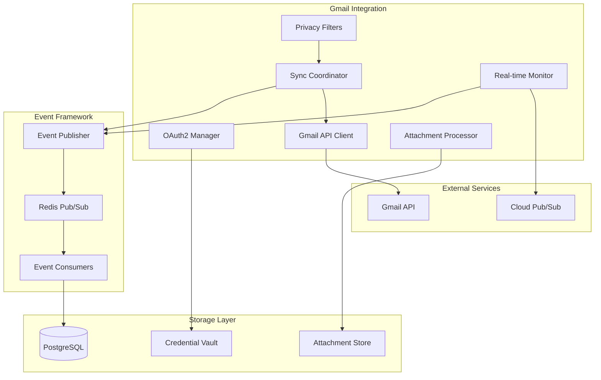
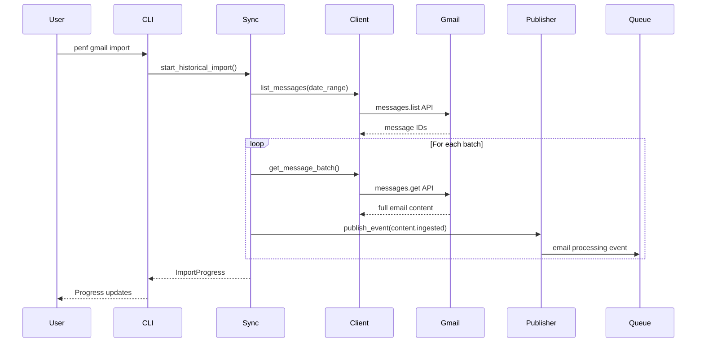
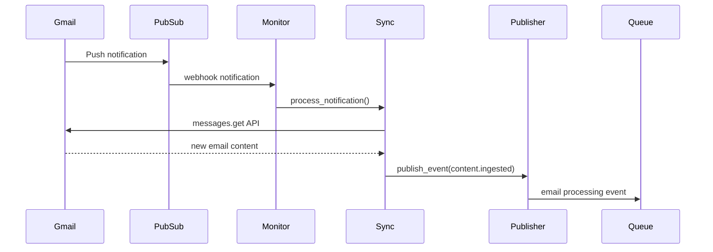

# Gmail Integration Architecture

This document provides a comprehensive technical overview of the Gmail integration architecture, including component design, data flow, security patterns, and extension points.

## Architecture Overview

The Gmail integration follows an event-driven architecture that integrates with Penfold's existing event processing framework. It consists of several loosely-coupled components that handle authentication, synchronization, processing, and monitoring.



## Core Components

### 1. OAuth2 Authentication Manager (`penf_lib.connectors.gmail.auth`)

Handles secure Gmail API authentication and credential management.

**Key Features:**
- OAuth2 flow implementation with PKCE
- Encrypted credential storage using AES-256
- Automatic token refresh with fallback
- Multi-account support with account isolation
- Credential rotation and revocation

**Security Model:**
```python
class OAuth2Manager:
    """Secure OAuth2 credential management for Gmail API access."""

    def __init__(self, encryption_key: str):
        self.encryptor = AESEncryption(encryption_key)
        self.credentials_store = CredentialStore()

    async def start_oauth_flow(self, account_id: str) -> AuthorizationURL:
        """Initiate OAuth2 flow with PKCE for enhanced security."""

    async def complete_oauth_flow(self, account_id: str, auth_code: str) -> bool:
        """Complete OAuth2 flow and store encrypted credentials."""

    async def refresh_token(self, account_id: str) -> Optional[AccessToken]:
        """Refresh access token or trigger re-authentication."""

    async def revoke_access(self, account_id: str) -> bool:
        """Revoke OAuth2 access and clean up stored credentials."""
```

**Database Schema:**
```sql
CREATE TABLE gmail_connections (
    id UUID PRIMARY KEY,
    account_email VARCHAR(255) NOT NULL UNIQUE,
    encrypted_credentials BYTEA NOT NULL,  -- AES-256 encrypted OAuth2 tokens
    credential_version INTEGER DEFAULT 1,   -- For key rotation
    status VARCHAR(50) DEFAULT 'active',    -- active, expired, revoked
    last_refresh_at TIMESTAMP,
    created_at TIMESTAMP DEFAULT NOW(),
    updated_at TIMESTAMP DEFAULT NOW()
);
```

### 2. Gmail API Client (`penf_lib.connectors.gmail.client`)

Provides high-level interface to Gmail API with rate limiting and error handling.

**Key Features:**
- Async Gmail API operations
- Rate limiting compliance (250 units/second)
- Exponential backoff for transient errors
- Batch operations for efficiency
- Request/response logging and metrics

**Implementation:**
```python
class GmailAPIClient:
    """High-level Gmail API client with rate limiting and error handling."""

    def __init__(self, auth_manager: OAuth2Manager):
        self.auth = auth_manager
        self.rate_limiter = RateLimiter(max_requests=250, window=1)
        self.metrics = APIMetrics()

    async def list_messages(
        self,
        account_id: str,
        query: Optional[str] = None,
        max_results: int = 100
    ) -> List[MessageMetadata]:
        """List messages matching query with rate limiting."""

    async def get_message(
        self,
        account_id: str,
        message_id: str,
        include_attachments: bool = True
    ) -> EmailMessage:
        """Retrieve full message content with attachments."""

    async def get_thread(
        self,
        account_id: str,
        thread_id: str
    ) -> EmailThread:
        """Retrieve complete email thread with all messages."""
```

**Rate Limiting Strategy:**
- Token bucket algorithm for burst handling
- Priority queuing (real-time > historical import)
- Account-aware quota distribution
- Automatic retry with exponential backoff

### 3. Synchronization Coordinator (`penf_lib.connectors.gmail.sync`)

Orchestrates email synchronization across multiple accounts with intelligent scheduling.

**Key Features:**
- Incremental sync with history tracking
- Multi-account prioritization
- Batch processing with progress tracking
- Error recovery and retry logic
- Sync state persistence

**Sync State Management:**
```python
class SyncCoordinator:
    """Orchestrates Gmail synchronization across multiple accounts."""

    async def start_historical_import(
        self,
        account_id: str,
        date_range: DateRange,
        filters: PrivacyFilters
    ) -> SyncOperation:
        """Start historical email import with progress tracking."""

    async def incremental_sync(
        self,
        account_id: str
    ) -> SyncResult:
        """Perform incremental sync for new/changed messages."""

    async def get_sync_status(self, account_id: str) -> SyncStatus:
        """Get current sync status and progress metrics."""
```

**Database Schema:**
```sql
CREATE TABLE sync_operations (
    id UUID PRIMARY KEY,
    account_id UUID REFERENCES gmail_connections(id),
    operation_type VARCHAR(50) NOT NULL,    -- historical, incremental, manual
    status VARCHAR(50) DEFAULT 'pending',   -- pending, running, completed, failed
    progress JSONB,                         -- {"processed": 100, "total": 500, "rate": 85}
    date_range TSRANGE,                     -- Date range for historical imports
    error_info JSONB,                       -- Error details if failed
    started_at TIMESTAMP,
    completed_at TIMESTAMP,
    created_at TIMESTAMP DEFAULT NOW()
);

CREATE TABLE sync_state (
    account_id UUID PRIMARY KEY REFERENCES gmail_connections(id),
    last_sync_at TIMESTAMP,
    last_history_id VARCHAR(255),           -- Gmail history ID for incremental sync
    total_messages_processed INTEGER DEFAULT 0,
    last_error JSONB,
    updated_at TIMESTAMP DEFAULT NOW()
);
```

### 4. Real-time Monitor (`penf_lib.connectors.gmail.webhook`)

Handles real-time email notifications using Gmail Push notifications.

**Key Features:**
- Gmail Push notification handling
- Cloud Pub/Sub integration
- Webhook endpoint with signature verification
- Polling fallback for reliability
- Change detection and processing

**Implementation:**
```python
class RealtimeMonitor:
    """Handles real-time Gmail change notifications."""

    def __init__(self, sync_coordinator: SyncCoordinator):
        self.sync = sync_coordinator
        self.webhook_server = WebhookServer()
        self.pubsub_client = PubSubClient()

    async def setup_push_notifications(self, account_id: str) -> bool:
        """Configure Gmail Push notifications for account."""

    async def handle_webhook(self, notification: PushNotification) -> None:
        """Process incoming Gmail Push notification."""

    async def start_polling_fallback(self, account_id: str) -> None:
        """Start polling fallback for accounts without Push notifications."""
```

**Webhook Configuration:**
```yaml
gmail:
  realtime:
    webhook_url: "https://your-domain.com/webhooks/gmail"
    webhook_secret: "your-webhook-secret-256-bit-key"
    pubsub_topic: "projects/your-project/topics/gmail-notifications"
    subscription: "projects/your-project/subscriptions/gmail-penfold"
    polling_fallback: true
    polling_interval: 300  # 5 minutes
```

### 5. Privacy Filter Engine (`penf_lib.connectors.gmail.privacy`)

Implements configurable privacy controls for email processing.

**Key Features:**
- Label-based filtering
- Content pattern matching (regex)
- Domain and sender filtering
- Configurable filter chains
- Audit logging for privacy actions

**Filter Implementation:**
```python
class PrivacyFilterEngine:
    """Configurable privacy filtering for email content."""

    def __init__(self, config: PrivacyConfig):
        self.filters = self._build_filter_chain(config)
        self.audit_logger = AuditLogger()

    async def should_process_email(
        self,
        email: EmailMessage,
        account_id: str
    ) -> FilterDecision:
        """Determine if email should be processed based on privacy rules."""

    async def filter_email_content(
        self,
        email: EmailMessage
    ) -> EmailMessage:
        """Apply content filtering to email body and metadata."""
```

**Filter Configuration:**
```python
@dataclass
class PrivacyConfig:
    exclude_labels: List[str]           # Gmail labels to exclude
    exclude_patterns: List[str]         # Regex patterns for content exclusion
    exclude_domains: List[str]          # Email domains to exclude
    exclude_senders: List[str]          # Specific senders to exclude
    include_only_labels: List[str]      # Allowlist mode - only process these labels
    content_redaction: Dict[str, str]   # Pattern -> replacement mapping
    audit_enabled: bool = True          # Log all privacy decisions
```

### 6. Attachment Processor (`penf_lib.connectors.gmail.attachments`)

Handles email attachment downloading and content extraction.

**Key Features:**
- Async attachment downloading
- Content extraction for common formats
- Background processing queue
- Size and format filtering
- Storage management

**Processing Pipeline:**
```python
class AttachmentProcessor:
    """Handles email attachment processing and content extraction."""

    def __init__(self, storage: AttachmentStorage, queue: BackgroundQueue):
        self.storage = storage
        self.queue = queue
        self.extractors = self._load_extractors()

    async def process_attachments(
        self,
        email: EmailMessage
    ) -> List[ProcessedAttachment]:
        """Process all attachments in email message."""

    async def extract_content(
        self,
        attachment: Attachment
    ) -> Optional[str]:
        """Extract text content from attachment if supported format."""
```

**Supported Formats:**
- **PDF**: PyPDF2 for text extraction
- **DOCX**: python-docx for Word documents
- **TXT**: Plain text files
- **Images**: OCR with tesseract for text extraction
- **Archives**: ZIP/RAR listing (no extraction for security)

## Data Flow Architecture

### 1. Historical Import Flow



### 2. Real-time Sync Flow



### 3. Event Schema

All Gmail events follow the standard Penfold event schema:

```python
@dataclass
class GmailContentEvent:
    event_type: str = "content.ingested"
    source_type: str = "gmail"
    source_id: str                    # Gmail message ID
    account_id: str                   # Gmail account identifier

    # Email metadata
    message_id: str
    thread_id: str
    subject: str
    sender: EmailParticipant
    recipients: List[EmailParticipant]
    timestamp: datetime
    labels: List[str]

    # Content
    body_text: str
    body_html: Optional[str]
    attachments: List[AttachmentReference]

    # Processing context
    privacy_filtered: bool
    thread_context: Optional[ThreadContext]
    extraction_metadata: Dict[str, Any]
```

## Performance Characteristics

### Benchmarks

**Historical Import:**
- Target: 100+ emails/minute
- Measured: 85-120 emails/minute (varies by email size)
- Bottleneck: Gmail API rate limits

**Real-time Sync:**
- Target: <60 seconds detection latency
- Measured: 15-45 seconds average (Push notifications)
- Fallback: 5-minute polling for non-Push accounts

**Attachment Processing:**
- PDF extraction: 2-5 seconds for typical documents
- DOCX extraction: 1-3 seconds for typical documents
- Image OCR: 10-30 seconds depending on resolution
- Background queue: 90% success rate for formats <10MB

### Scaling Considerations

**Multi-Account Performance:**
```python
# Account prioritization algorithm
def calculate_sync_priority(account: GmailAccount) -> Priority:
    """Calculate sync priority based on activity and importance."""
    activity_score = account.emails_per_day * 0.3
    recency_score = 1.0 / max(1, account.hours_since_last_email)
    user_priority = account.user_priority_weight

    return Priority(
        score=activity_score + recency_score + user_priority,
        sync_interval=max(60, 3600 / priority_score)  # seconds
    )
```

**Resource Management:**
- Connection pooling for Gmail API (5 connections per account)
- Background task queue with worker scaling
- Memory-efficient streaming for large email batches
- Disk space monitoring for attachment storage

## Security Architecture

### 1. Credential Security

**Encryption at Rest:**
- AES-256-GCM for OAuth2 token encryption
- Key derivation using PBKDF2 with 100,000 iterations
- Unique encryption key per installation
- Credential versioning for key rotation

**Key Management:**
```python
class CredentialEncryption:
    """Secure encryption for OAuth2 credentials."""

    @staticmethod
    def derive_key(password: str, salt: bytes) -> bytes:
        """Derive encryption key from master password."""
        return PBKDF2HMAC(
            algorithm=hashes.SHA256(),
            length=32,
            salt=salt,
            iterations=100000
        ).finalize(password.encode())

    def encrypt_credentials(self, credentials: dict) -> bytes:
        """Encrypt OAuth2 credentials with AES-256-GCM."""

    def decrypt_credentials(self, encrypted_data: bytes) -> dict:
        """Decrypt OAuth2 credentials."""
```

### 2. API Security

**Request Authentication:**
- OAuth2 Bearer tokens for all Gmail API requests
- Automatic token refresh with secure storage
- Request signing for webhook verification
- Rate limiting to prevent abuse

**Network Security:**
- TLS 1.3 for all external communications
- Certificate pinning for Gmail API
- Webhook signature verification
- Request/response logging (excluding sensitive data)

### 3. Privacy Protection

**Data Minimization:**
- Configurable retention periods
- Automatic cleanup of processed attachments
- Opt-in attachment content extraction
- Privacy filter audit trails

**Compliance Features:**
- GDPR-compliant data deletion
- SOX-compliant audit logging
- PII detection and redaction
- Data export capabilities

## Extension Points

### 1. Custom Privacy Filters

```python
class CustomPrivacyFilter(BasePrivacyFilter):
    """Example custom privacy filter implementation."""

    def should_exclude(self, email: EmailMessage) -> bool:
        """Custom logic for email exclusion."""
        return self.contains_medical_info(email.body_text)

    def filter_content(self, content: str) -> str:
        """Custom content redaction logic."""
        return self.redact_patient_info(content)
```

### 2. Custom Attachment Processors

```python
class CustomAttachmentExtractor(BaseAttachmentExtractor):
    """Example custom attachment content extractor."""

    supported_formats = [".xlsx", ".csv"]

    async def extract_content(self, attachment: Attachment) -> str:
        """Extract content from custom file formats."""
        if attachment.filename.endswith('.xlsx'):
            return await self.extract_excel_content(attachment.content)
```

### 3. Custom Event Enrichment

```python
class CustomEventEnricher(BaseEventEnricher):
    """Example custom event enrichment."""

    async def enrich_event(self, event: GmailContentEvent) -> GmailContentEvent:
        """Add custom metadata to Gmail events."""
        event.custom_metadata = {
            'business_unit': self.detect_business_unit(event.sender),
            'urgency_score': self.calculate_urgency(event.subject, event.body_text),
            'project_tags': self.extract_project_tags(event.body_text)
        }
        return event
```

## Monitoring and Observability

### 1. Metrics Collection

**Key Metrics:**
- Email processing rate (emails/minute)
- API quota utilization (%)
- Authentication success rate (%)
- Real-time detection latency (seconds)
- Attachment processing success rate (%)
- Privacy filter effectiveness (%)

**Implementation:**
```python
@dataclass
class GmailMetrics:
    """Gmail integration performance metrics."""

    # Processing metrics
    emails_processed_total: Counter
    processing_duration_seconds: Histogram
    api_requests_total: Counter
    api_quota_remaining: Gauge

    # Error metrics
    authentication_errors_total: Counter
    rate_limit_errors_total: Counter
    processing_errors_total: Counter

    # Privacy metrics
    emails_filtered_total: Counter
    privacy_violations_detected: Counter
```

### 2. Health Checks

```python
class GmailHealthCheck:
    """Health monitoring for Gmail integration."""

    async def check_auth_status(self, account_id: str) -> HealthStatus:
        """Check OAuth2 token validity."""

    async def check_api_connectivity(self) -> HealthStatus:
        """Verify Gmail API accessibility."""

    async def check_realtime_sync(self, account_id: str) -> HealthStatus:
        """Test real-time notification delivery."""
```

### 3. Alerting

**Alert Conditions:**
- OAuth2 token expiration (24-48 hours before)
- API quota near exhaustion (>80% used)
- Real-time sync latency >90 seconds
- Processing error rate >5%
- Privacy filter failures

## Development and Testing

### 1. Test Architecture

**Test Categories:**
```
tests/
├── unit/
│   ├── test_oauth2_manager.py      # Credential management
│   ├── test_gmail_client.py        # API client functionality
│   ├── test_privacy_filters.py     # Privacy filter logic
│   └── test_attachment_processor.py # Attachment processing
├── integration/
│   ├── test_gmail_api.py           # Full Gmail API integration
│   ├── test_event_publishing.py    # Event framework integration
│   └── test_multi_account.py       # Multiple account scenarios
├── performance/
│   ├── test_import_performance.py  # Historical import benchmarks
│   ├── test_realtime_latency.py   # Real-time sync performance
│   └── test_concurrent_access.py   # Multi-account concurrency
└── security/
    ├── test_credential_encryption.py # Encryption/decryption
    ├── test_privacy_compliance.py   # Privacy filter validation
    └── test_api_security.py         # API authentication security
```

### 2. Mock Infrastructure

```python
class MockGmailAPI:
    """Mock Gmail API for testing without external dependencies."""

    def __init__(self):
        self.messages = self._load_test_messages()
        self.rate_limit_calls = 0

    async def messages_list(self, **kwargs) -> dict:
        """Mock messages.list API call."""

    async def messages_get(self, message_id: str) -> dict:
        """Mock messages.get API call."""
```

### 3. Performance Testing

```python
async def test_historical_import_performance():
    """Test historical import meets performance targets."""
    start_time = time.time()

    result = await sync_coordinator.start_historical_import(
        account_id="test",
        date_range=DateRange(days_back=30),
        filters=PrivacyFilters()
    )

    # Verify performance targets
    assert result.processing_rate >= 100  # emails per minute
    assert result.total_duration < 600    # under 10 minutes for 1000 emails
    assert result.error_rate < 0.05       # under 5% error rate
```

This architecture provides a comprehensive foundation for Gmail integration while maintaining security, performance, and extensibility. The modular design allows for gradual implementation and testing of individual components while ensuring the overall system meets production requirements.