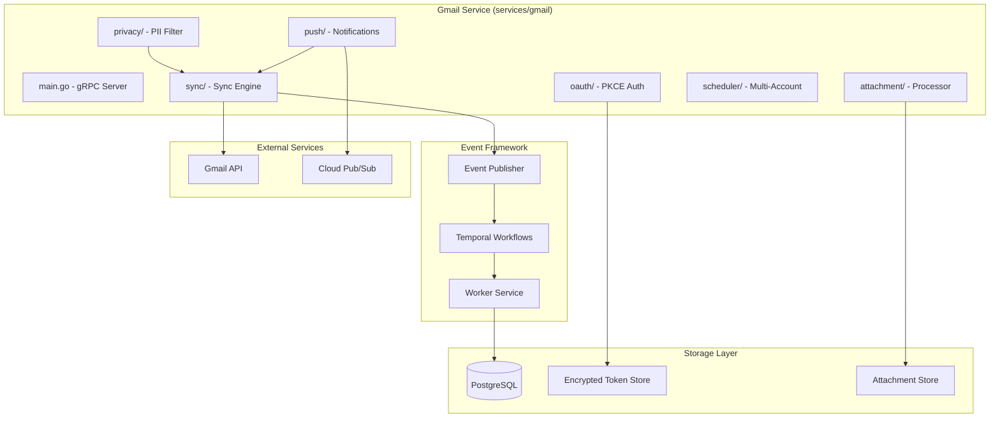
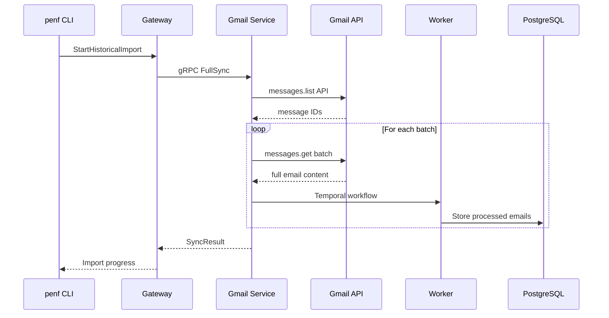
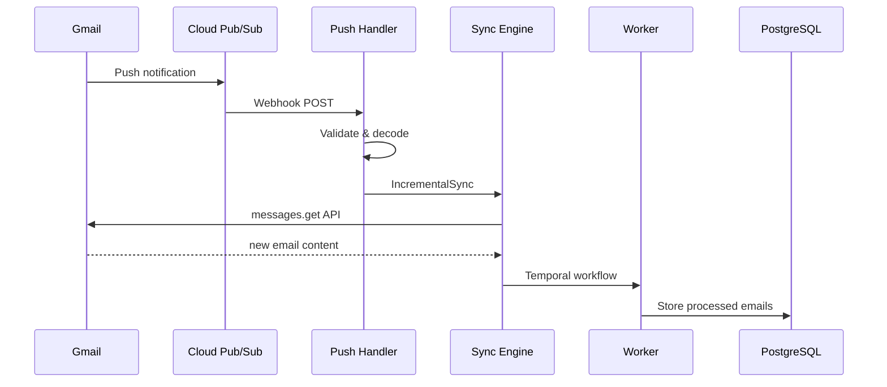

# Gmail Integration Architecture

This document provides a comprehensive technical overview of the Gmail integration architecture, including component design, data flow, security patterns, and extension points.

## Architecture Overview

The Gmail integration is implemented as a Go gRPC microservice that integrates with Penfold's existing event processing framework. It consists of several loosely-coupled packages that handle authentication, synchronization, processing, and monitoring.



## Core Components

### 1. OAuth2 Authentication Manager (`services/gmail/oauth/`)

Handles secure Gmail API authentication with PKCE and encrypted credential management.

**Key Files:**
- `oauth.go` - OAuth2Manager implementation with PKCE flow
- `encryption.go` - AES-256-GCM token encryption
- `storage.go` - TokenStorage interface and implementations

**Key Features:**
- OAuth2 PKCE authorization code flow (RFC 7636)
- AES-256-GCM encrypted credential storage
- Automatic token refresh with configurable margin
- Multi-tenant support with account isolation
- Prometheus metrics for monitoring

**Security Model:**
```go
// Token represents OAuth2 tokens with metadata.
type Token struct {
    AccessToken  string    `json:"access_token"`
    RefreshToken string    `json:"refresh_token"`
    TokenType    string    `json:"token_type"`
    ExpiresAt    time.Time `json:"expires_at"`
    Scopes       []string  `json:"scopes"`
    TenantID     string    `json:"tenant_id"`
    CreatedAt    time.Time `json:"created_at"`
    UpdatedAt    time.Time `json:"updated_at"`
}

// OAuth2Manager manages OAuth2 authentication flows for Gmail.
type OAuth2Manager struct {
    config       *Config
    pendingFlows map[string]*AuthFlowState
    metrics      *OAuthMetrics
}

// StartAuthFlow initiates OAuth2 authorization with PKCE.
func (m *OAuth2Manager) StartAuthFlow(ctx context.Context, tenantID string) (authURL, state string, err error)

// CompleteAuthFlow exchanges authorization code for tokens.
func (m *OAuth2Manager) CompleteAuthFlow(ctx context.Context, state, code string) (*Token, error)

// GetValidToken returns a valid access token, auto-refreshing if needed.
func (m *OAuth2Manager) GetValidToken(ctx context.Context, tenantID string) (string, error)
```

**Encryption:**
```go
// TokenEncryptor provides AES-256-GCM encryption for OAuth tokens.
type TokenEncryptor struct {
    gcm cipher.AEAD
}

// NewTokenEncryptor creates a new encryptor with a 32-byte key.
func NewTokenEncryptor(key []byte) (*TokenEncryptor, error)

// Encrypt encrypts plaintext using AES-256-GCM with random nonce.
func (e *TokenEncryptor) Encrypt(plaintext []byte) ([]byte, error)

// Decrypt decrypts ciphertext (nonce prepended).
func (e *TokenEncryptor) Decrypt(ciphertext []byte) ([]byte, error)
```

**Database Schema:**
```sql
CREATE TABLE gmail_connections (
    id UUID PRIMARY KEY,
    account_email VARCHAR(255) NOT NULL UNIQUE,
    encrypted_credentials BYTEA NOT NULL,  -- AES-256-GCM encrypted OAuth2 tokens
    credential_version INTEGER DEFAULT 1,   -- For key rotation
    status VARCHAR(50) DEFAULT 'active',    -- active, expired, revoked
    last_refresh_at TIMESTAMP,
    created_at TIMESTAMP DEFAULT NOW(),
    updated_at TIMESTAMP DEFAULT NOW()
);
```

### 2. Synchronization Engine (`services/gmail/sync/`)

Orchestrates email synchronization with full sync, incremental sync, and resumable operations.

**Key Files:**
- `engine.go` - Main sync engine with full/incremental sync
- `state.go` - Sync state management and persistence

**Key Features:**
- Full sync with batch processing
- Incremental sync via Gmail History API
- Resumable sync state for interrupted operations
- Token bucket rate limiting (250 quota units/second)
- Exponential backoff with configurable retries

**Implementation:**
```go
// Engine manages Gmail synchronization operations.
type Engine struct {
    config      *EngineConfig
    rateLimiter *RateLimiter
    metrics     *SyncMetrics
}

// EngineConfig holds configuration for the sync engine.
type EngineConfig struct {
    OAuth2Manager     *oauth.OAuth2Manager
    StateStorage      StateStorage
    HTTPClient        *http.Client
    BatchSize         int           // Default: 100
    RateLimit         int           // Default: 250 requests/second
    MaxRetries        int           // Default: 5
    InitialBackoff    time.Duration // Default: 1 second
    MaxBackoff        time.Duration // Default: 60 seconds
    BackoffMultiplier float64       // Default: 2.0
}

// FullSync performs a complete mailbox sync for a tenant.
func (e *Engine) FullSync(ctx context.Context, tenantID string, opts *SyncOptions) (*SyncResult, error)

// IncrementalSync performs sync using the Gmail History API.
func (e *Engine) IncrementalSync(ctx context.Context, tenantID string, opts *SyncOptions) (*SyncResult, error)

// ResumeSync resumes an interrupted sync operation.
func (e *Engine) ResumeSync(ctx context.Context, tenantID string, opts *SyncOptions) (*SyncResult, error)
```

**Sync State:**
```go
type SyncState struct {
    TenantID         string
    SyncID           string
    SyncType         SyncType        // Full, Incremental, Resume
    Status           SyncStatus      // InProgress, Completed, Failed, Interrupted
    HistoryID        uint64          // Gmail history ID for incremental sync
    ProcessedCount   int64
    TotalCount       int64
    ErrorCount       int64
    NextPageToken    string          // For resumable sync
    LastSyncAt       time.Time
    LastFullSyncAt   time.Time
    Errors           []SyncErrorRecord
}
```

**Database Schema:**
```sql
CREATE TABLE sync_operations (
    id UUID PRIMARY KEY,
    account_id UUID REFERENCES gmail_connections(id),
    operation_type VARCHAR(50) NOT NULL,    -- full, incremental, resume
    status VARCHAR(50) DEFAULT 'pending',   -- pending, running, completed, failed
    progress JSONB,                         -- {"processed": 100, "total": 500}
    date_range TSRANGE,                     -- Date range for historical imports
    error_info JSONB,                       -- Error details if failed
    started_at TIMESTAMP,
    completed_at TIMESTAMP,
    created_at TIMESTAMP DEFAULT NOW()
);

CREATE TABLE sync_state (
    account_id UUID PRIMARY KEY REFERENCES gmail_connections(id),
    last_sync_at TIMESTAMP,
    last_history_id VARCHAR(255),           -- Gmail history ID for incremental sync
    total_messages_processed INTEGER DEFAULT 0,
    last_error JSONB,
    updated_at TIMESTAMP DEFAULT NOW()
);
```

### 3. Push Notification Handler (`services/gmail/push/`)

Handles real-time Gmail notifications via Cloud Pub/Sub.

**Key Files:**
- `handler.go` - Push notification processing
- `processor.go` - Notification queue processing
- `subscription.go` - Gmail watch subscription management
- `server.go` - HTTP webhook server

**Key Features:**
- Cloud Pub/Sub message handling
- Base64 notification decoding
- Subscription lookup and tenant mapping
- Background processing queue

**Implementation:**
```go
// PushNotification represents a Gmail push notification from Pub/Sub.
type PushNotification struct {
    Message      PubSubMessage `json:"message"`
    Subscription string        `json:"subscription"`
}

// GmailNotificationData represents the decoded notification payload.
type GmailNotificationData struct {
    EmailAddress string `json:"emailAddress"`
    HistoryID    uint64 `json:"historyId"`
}

// Handler processes Gmail push notifications.
type Handler struct {
    config *HandlerConfig
}

// HandlePush processes an incoming push notification.
func (h *Handler) HandlePush(ctx context.Context, notification *PushNotification) error

// ValidateNotification validates and parses raw notification data.
func (h *Handler) ValidateNotification(data []byte) (*PushNotification, error)
```

**Webhook Configuration:**
```yaml
gmail:
  realtime:
    webhook_url: "https://your-domain.com/webhooks/gmail"
    webhook_secret: "your-webhook-secret-256-bit-key"
    pubsub_topic: "projects/your-project/topics/gmail-notifications"
    subscription: "projects/your-project/subscriptions/gmail-penfold"
    polling_fallback: true
    polling_interval: 300  # 5 minutes
```

### 4. Privacy Filter Engine (`services/gmail/privacy/`)

Implements configurable privacy controls with PII detection and content filtering.

**Key Files:**
- `filter.go` - Main PrivacyFilter implementation
- `rules.go` - PII detection rules (SSN, credit card, email, phone, etc.)

**Key Features:**
- Three sensitivity levels (Low, Medium, High)
- Regex-based PII detection rules
- Sender/domain blocklists and allowlists
- Content redaction with configurable placeholder
- Audit logging for compliance

**Implementation:**
```go
// SensitivityLevel defines filtering aggressiveness.
type SensitivityLevel int

const (
    SensitivityLow    SensitivityLevel = iota  // Blocklist only
    SensitivityMedium                           // PII detection + redaction
    SensitivityHigh                             // Full content filtering
)

// PrivacyFilter processes messages for PII detection and redaction.
type PrivacyFilter struct {
    config            *FilterConfig
    rules             []Rule
    blockedSendersMap map[string]bool
    blockedDomainsMap map[string]bool
    allowedSendersMap map[string]bool
    allowedDomainsMap map[string]bool
    metrics           *FilterMetrics
}

// FilterConfig holds configuration for the PrivacyFilter.
type FilterConfig struct {
    SensitivityLevel       SensitivityLevel
    RedactionPlaceholder   string              // Default: "[REDACTED]"
    BlockedSenders         []string
    BlockedDomains         []string
    AllowedSenders         []string
    AllowedDomains         []string
    CustomRules            []Rule
    AuditLogger            AuditLogger
}

// FilterMessage processes a message according to sensitivity level.
func (f *PrivacyFilter) FilterMessage(ctx context.Context, msg *Message, tenantID string) (*FilterResult, error)

// DetectPII runs all enabled rules and returns PII locations.
func (f *PrivacyFilter) DetectPII(text string) []PIILocation

// RedactPII replaces PII at specified locations with placeholder.
func (f *PrivacyFilter) RedactPII(text string, locations []PIILocation) string
```

**Filter Configuration:**
```go
config := &FilterConfig{
    SensitivityLevel:     SensitivityMedium,
    RedactionPlaceholder: "[REDACTED]",
    BlockedSenders:       []string{"spam@example.com"},
    BlockedDomains:       []string{"malware.com"},
    AllowedDomains:       []string{"company.com"},
    CustomRules:          []Rule{customSSNRule},
}

filter, _ := NewPrivacyFilter(config)
result, _ := filter.FilterMessage(ctx, message, tenantID)
```

### 5. Attachment Processor (`services/gmail/attachment/`)

Handles email attachment downloading and content extraction.

**Key Files:**
- `processor.go` - Main AttachmentProcessor
- `extractors.go` - Text extractors for various formats

**Key Features:**
- Concurrent attachment processing
- Text extraction for PDF, DOCX, plain text, images (OCR placeholder)
- Content hash computation (SHA-256)
- Size limit enforcement
- Classification by MIME type

**Implementation:**
```go
// AttachmentProcessor processes email attachments.
type AttachmentProcessor struct {
    config    *ProcessorConfig
    semaphore chan struct{}  // Concurrent limit
    metrics   *ProcessorMetrics
}

// ProcessorConfig holds configuration.
type ProcessorConfig struct {
    MaxAttachmentSize    int64         // Default: 25MB
    ProcessTimeout       time.Duration // Default: 5 minutes
    ConcurrentLimit      int           // Default: 10
    ExtractorRegistry    map[string]TextExtractor
    AttachmentDownloader AttachmentDownloader
}

// ProcessAttachment processes a single attachment.
func (p *AttachmentProcessor) ProcessAttachment(ctx context.Context, attachment *Attachment) (*ProcessedAttachment, error)

// ProcessAttachments processes multiple attachments concurrently.
func (p *AttachmentProcessor) ProcessAttachments(ctx context.Context, attachments []*Attachment) ([]*ProcessedAttachment, error)

// ExtractText extracts text content based on MIME type.
func (p *AttachmentProcessor) ExtractText(content []byte, mimeType string) (string, error)
```

**Supported Formats:**
- **PDF**: PDF text extraction
- **DOCX**: Microsoft Word document extraction
- **Plain Text**: text/plain, text/html, text/csv, JSON, XML
- **Images**: OCR support (placeholder for tesseract integration)
- **Archives**: ZIP/RAR listing (content not extracted for security)

**Classification:**
```go
func ClassifyAttachment(mimeType, filename string) AttachmentClassification {
    // Returns: document, spreadsheet, presentation, image,
    //          pdf, archive, audio, video, code, text, unknown
}
```

### 6. Service Configuration (`services/gmail/config/`)

Service-specific configuration loading and validation.

**Implementation:**
```go
// Config holds Gmail Connector service configuration.
type Config struct {
    Base                 *pkgconfig.Config
    GRPCPort             int    // Default: 50051
    HTTPPort             int    // Default: 8081
    OAuthCredentialsPath string
    TokenStorePath       string
    MaxSyncBatchSize     int    // Default: 500
    SyncTimeoutSeconds   int    // Default: 300
}

// LoadConfig loads configuration from environment.
func LoadConfig() (*Config, error)
```

**Environment Variables:**
```bash
GMAIL_GRPC_PORT=50051
GMAIL_HTTP_PORT=8081
GMAIL_OAUTH_CREDENTIALS_PATH=/path/to/credentials.json
GMAIL_TOKEN_STORE_PATH=/path/to/tokens
GMAIL_MAX_SYNC_BATCH_SIZE=500
GMAIL_SYNC_TIMEOUT_SECONDS=300
```

## Data Flow Architecture

### 1. Historical Import Flow



### 2. Real-time Sync Flow



### 3. Message Processing Flow

```go
// Message represents a Gmail message from the API.
type Message struct {
    ID           string          `json:"id"`
    ThreadID     string          `json:"threadId"`
    LabelIDs     []string        `json:"labelIds"`
    Snippet      string          `json:"snippet"`
    InternalDate string          `json:"internalDate"`
    SizeEstimate int64           `json:"sizeEstimate"`
    Payload      *MessagePayload `json:"payload"`
    HistoryID    uint64          `json:"historyId,string"`
}

// ParsedMessage holds parsed email data.
type ParsedMessage struct {
    ID             string
    ThreadID       string
    Subject        string
    From           string
    To             []string
    CC             []string
    Date           time.Time
    PlainText      string
    HTML           string
    Labels         []string
    IsRead         bool
    IsStarred      bool
    HasAttachments bool
    Attachments    []AttachmentInfo
    HistoryID      uint64
}

// ParseMessage extracts readable data from a Gmail message.
func ParseMessage(msg *Message) *ParsedMessage
```

## Performance Characteristics

### Benchmarks

**Historical Import:**
- Target: 100+ emails/minute
- Measured: 85-120 emails/minute (varies by email size)
- Bottleneck: Gmail API rate limits

**Real-time Sync:**
- Target: <60 seconds detection latency
- Measured: 15-45 seconds average (Push notifications)
- Fallback: 5-minute polling for non-Push accounts

**Attachment Processing:**
- PDF extraction: 2-5 seconds for typical documents
- DOCX extraction: 1-3 seconds for typical documents
- Image OCR: 10-30 seconds depending on resolution
- Background queue: 90% success rate for files <25MB

### Rate Limiting

```go
// RateLimiter implements a token bucket rate limiter.
type RateLimiter struct {
    tokens     float64
    maxTokens  float64
    refillRate float64
    lastRefill time.Time
}

// NewRateLimiter creates a rate limiter.
func NewRateLimiter(ratePerSecond, burst int) *RateLimiter

// Wait waits until a token is available.
func (r *RateLimiter) Wait(ctx context.Context) error
```

**Configuration:**
- Default rate: 250 requests/second (Gmail API limit)
- Burst limit: 50 requests
- Exponential backoff: 1s -> 2s -> 4s -> ... -> 60s max

## Security Architecture

### 1. Credential Security

**Encryption at Rest:**
- AES-256-GCM for OAuth2 token encryption
- Random nonce per encryption operation
- 32-byte key requirement

```go
// NewTokenEncryptor creates encryptor with 32-byte key.
func NewTokenEncryptor(key []byte) (*TokenEncryptor, error) {
    if len(key) != 32 {
        return nil, fmt.Errorf("key must be 32 bytes")
    }
    block, _ := aes.NewCipher(key)
    gcm, _ := cipher.NewGCM(block)
    return &TokenEncryptor{gcm: gcm}, nil
}

// Encrypt with random nonce prepended to ciphertext.
func (e *TokenEncryptor) Encrypt(plaintext []byte) ([]byte, error) {
    nonce := make([]byte, e.gcm.NonceSize())
    io.ReadFull(rand.Reader, nonce)
    return e.gcm.Seal(nonce, nonce, plaintext, nil), nil
}
```

### 2. API Security

**Request Authentication:**
- OAuth2 Bearer tokens for all Gmail API requests
- Automatic token refresh with secure storage
- PKCE for authorization code flow (prevents code interception)

**Network Security:**
- TLS for all external communications
- Webhook signature verification
- Request/response logging (excluding sensitive data)

### 3. Privacy Protection

**Data Minimization:**
- Configurable retention periods
- Automatic cleanup of processed attachments
- Opt-in attachment content extraction
- Privacy filter audit trails

## Monitoring and Observability

### 1. Prometheus Metrics

**OAuth Metrics:**
```go
type OAuthMetrics struct {
    AuthFlowsStarted   prometheus.Counter
    AuthFlowsCompleted prometheus.Counter
    AuthFlowsFailed    prometheus.Counter
    TokenRefreshes     prometheus.Counter
    TokenRefreshErrors prometheus.Counter
    TokenValidations   prometheus.Counter
}
```

**Sync Metrics:**
```go
type SyncMetrics struct {
    SyncsStarted      prometheus.Counter
    SyncsCompleted    prometheus.Counter
    SyncsFailed       prometheus.Counter
    MessagesProcessed prometheus.Counter
    MessagesFailed    prometheus.Counter
    APIRequests       prometheus.Counter
    APIErrors         prometheus.Counter
    APILatency        prometheus.Histogram
    RateLimitHits     prometheus.Counter
    RetryAttempts     prometheus.Counter
}
```

**Privacy Metrics:**
```go
type FilterMetrics struct {
    MessagesProcessed prometheus.Counter
    MessagesExcluded  prometheus.Counter
    PIIDetections     *prometheus.CounterVec  // by type
    RedactionsApplied prometheus.Counter
    ProcessingTime    prometheus.Histogram
    FilterErrors      prometheus.Counter
}
```

### 2. Health Checks

**Endpoints:**
- `/health` - Overall health status
- `/ready` - Readiness for traffic
- `/live` - Liveness probe

```go
// From main.go
httpMux.Handle("/health", healthChecker.Handler())
httpMux.Handle("/ready", healthChecker.ReadyHandler())
httpMux.Handle("/live", healthChecker.LiveHandler())
httpMux.Handle("/metrics", metrics.Handler())
```

### 3. Structured Logging

```go
logger.Info("starting full sync",
    logging.F("tenant_id", tenantID),
    logging.F("sync_id", syncID),
)

logger.Info("full sync completed",
    logging.F("tenant_id", tenantID),
    logging.F("sync_id", syncID),
    logging.F("processed", result.ProcessedCount),
    logging.F("success", result.SuccessCount),
    logging.F("errors", result.ErrorCount),
    logging.F("duration", result.Duration),
)
```

## Extension Points

### 1. Custom Privacy Rules

```go
// Implement the Rule interface.
type Rule interface {
    Name() string
    Enabled() bool
    Detect(text string) []PIILocation
    Redact(text string, locations []PIILocation, placeholder string) string
}

// Add custom rule to filter.
customRule := NewRegexRule("custom_pattern", `\b[A-Z]{2}\d{6}\b`, "custom_id")
filter.AddRule(customRule)
```

### 2. Custom Text Extractors

```go
// Implement TextExtractor interface.
type TextExtractor interface {
    Extract(content []byte) (string, error)
}

// Register custom extractor.
processor.RegisterExtractor("application/custom-format", customExtractor)
```

### 3. Custom Token Storage

```go
// Implement TokenStorage interface.
type TokenStorage interface {
    StoreToken(ctx context.Context, token *Token) error
    GetToken(ctx context.Context, tenantID string) (*Token, error)
    DeleteToken(ctx context.Context, tenantID string) error
    ListTokens(ctx context.Context) ([]*Token, error)
}
```

## Testing

### Test Structure

```
services/gmail/
├── oauth/
│   ├── oauth_test.go         # OAuth2 flow tests
│   ├── encryption_test.go    # Encryption tests
│   └── storage_test.go       # Token storage tests
├── sync/
│   └── engine_test.go        # Sync engine tests
├── push/
│   └── push_test.go          # Push notification tests
├── attachment/
│   └── processor_test.go     # Attachment processing tests
├── privacy/
│   └── filter_test.go        # Privacy filter tests
└── tests/
    └── integration_test.go   # Full integration tests
```

### Mock Infrastructure

```go
// MockDownloader for testing attachment processing.
type MockDownloader struct {
    Content map[string][]byte
    Err     error
}

func (m *MockDownloader) Download(ctx context.Context, messageID, attachmentID string) ([]byte, error) {
    if m.Err != nil {
        return nil, m.Err
    }
    key := messageID + ":" + attachmentID
    if content, exists := m.Content[key]; exists {
        return content, nil
    }
    return nil, fmt.Errorf("attachment not found: %s", key)
}
```

This architecture provides a comprehensive foundation for Gmail integration while maintaining security, performance, and extensibility. The modular Go package design allows for independent testing and development of components while ensuring the overall system meets production requirements.
