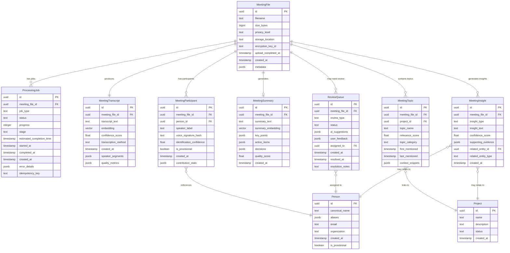

# Meeting Pipeline Data Model

**Created**: 2026-01-14
**Phase**: 1 - Design & Contracts

## Entity Relationships



## Core Entities

### MeetingFile

**Purpose**: Represents uploaded meeting recordings and documents

**Key Fields**:
- `id` (UUID): Primary identifier
- `filename` (TEXT): Original filename from upload
- `size_bytes` (BIGINT): File size for storage management
- `privacy_level` (TEXT): 'public', 'organization', 'team_only', 'confidential'
- `storage_location` (TEXT): 'local', 'cloud', 'hybrid'
- `encryption_key_id` (TEXT): Reference to encryption key for confidential files
- `metadata` (JSONB): File format, duration, upload source, etc.

**Validation Rules**:
- `size_bytes` must be ≤ 2GB (2,147,483,648 bytes)
- `privacy_level` must be one of the four defined levels
- `filename` cannot be null or empty
- `encryption_key_id` required when `privacy_level` is 'confidential'

**State Transitions**:
```
uploading → upload_completed → processing → processed → archived
```

### ProcessingJob

**Purpose**: Tracks background processing jobs for meeting files

**Key Fields**:
- `meeting_file_id` (UUID): Reference to the file being processed
- `job_type` (TEXT): 'upload', 'transcription', 'analysis', 'embedding_generation'
- `status` (TEXT): 'queued', 'processing', 'completed', 'failed', 'dead_letter'
- `progress` (INTEGER): 0-100 percentage complete
- `stage` (TEXT): Current processing stage for multi-step jobs
- `idempotency_key` (TEXT): Prevents duplicate job creation

**Validation Rules**:
- `progress` must be 0-100
- `job_type` must be one of the defined types
- `idempotency_key` must be unique for active jobs
- `estimated_completion_time` calculated based on file size and job type

**Lifecycle Management**:
- Jobs automatically transition from 'queued' to 'processing' when picked up by worker
- Failed jobs retry up to 5 times with exponential backoff
- Jobs failing 5 times move to 'dead_letter' status for manual review

### MeetingTranscript

**Purpose**: Stores transcribed text from audio/video meetings

**Key Fields**:
- `transcript_text` (TEXT): Full meeting transcript with speaker labels
- `embedding` (VECTOR): pgvector embedding for semantic search
- `confidence_score` (FLOAT): Overall transcription confidence (0.0-1.0)
- `transcription_method` (TEXT): 'whisper_local', 'google_cloud', 'manual'
- `speaker_segments` (JSONB): Array of {speaker, start_time, end_time, text, confidence}
- `quality_metrics` (JSONB): Audio quality, SNR, processing time

**Validation Rules**:
- `confidence_score` must be 0.0-1.0
- `transcription_method` must be one of the defined methods
- `speaker_segments` array must have valid timestamps
- `embedding` dimension must match model requirements (1536 for OpenAI)

**Search Integration**:
- Full-text search using PostgreSQL built-in capabilities
- Semantic search via pgvector cosine similarity
- Combined scoring for hybrid search results

### MeetingParticipant

**Purpose**: Links meeting participants to person entities with speaker identification

**Key Fields**:
- `person_id` (UUID): Reference to Person entity (null for provisional)
- `speaker_label` (TEXT): AI-generated speaker identifier ("Speaker 1", "Speaker 2")
- `voice_signature_hash` (TEXT): Hash of voice characteristics for future matching
- `identification_confidence` (FLOAT): Confidence in person entity linking (0.0-1.0)
- `is_provisional` (BOOLEAN): True for unidentified speakers
- `contribution_stats` (JSONB): Speaking time, word count, interruptions

**Entity Resolution Flow**:
1. AI identifies speakers and generates voice signatures
2. Attempts to match with existing Person entities
3. Creates provisional Person entity if confidence < 0.8
4. Queues for manual review if multiple possible matches

**Validation Rules**:
- Either `person_id` must be set OR `is_provisional` must be true
- `identification_confidence` required when `person_id` is set
- `voice_signature_hash` must be unique within meeting
- `contribution_stats` must have valid numeric values

### MeetingSummary

**Purpose**: AI-generated summaries and key insights from meetings

**Key Fields**:
- `summary_text` (TEXT): Concise meeting summary
- `summary_embedding` (VECTOR): Embedding for summary-based search
- `key_points` (JSONB): Array of important discussion points
- `action_items` (JSONB): Array of {item, assignee, deadline, status}
- `decisions` (JSONB): Array of decisions made with context
- `quality_score` (FLOAT): AI confidence in summary accuracy

**Structure Examples**:
```json
{
  "key_points": [
    {
      "point": "Budget approval needed for Q2 marketing campaign",
      "timestamp": "00:15:30",
      "speakers": ["Alice Johnson", "Bob Smith"],
      "confidence": 0.92
    }
  ],
  "action_items": [
    {
      "item": "Prepare budget proposal for marketing campaign",
      "assignee": "Alice Johnson",
      "deadline": "2024-01-20",
      "status": "pending",
      "confidence": 0.88
    }
  ],
  "decisions": [
    {
      "decision": "Postpone product launch by 2 weeks",
      "rationale": "Wait for security audit completion",
      "timestamp": "00:45:15",
      "confidence": 0.95
    }
  ]
}
```

### ReviewQueue

**Purpose**: Manages manual review tasks for failed automatic processing

**Key Fields**:
- `review_type` (TEXT): 'speaker_identification', 'project_linking', 'transcription_quality'
- `status` (TEXT): 'pending', 'in_review', 'completed', 'escalated'
- `ai_suggestions` (JSONB): AI recommendations with confidence scores
- `user_feedback` (JSONB): Human reviewer decisions and corrections
- `assigned_to` (UUID): Person assigned to review the item

**Review Types**:
- **speaker_identification**: Unknown speakers needing manual linking
- **project_linking**: Meetings that couldn't be auto-linked to projects
- **transcription_quality**: Low-confidence transcripts needing validation
- **content_sensitivity**: Potential privacy or compliance concerns

**Workflow Integration**:
- Items automatically created when AI confidence falls below thresholds
- Reviewers receive notifications via event system
- Completed reviews trigger reprocessing of affected content
- Feedback improves future AI accuracy through learning

## Data Volume Estimates

**Assumptions**: 50 meetings/month, average 1-hour duration, 8 participants

**Storage Requirements**:
- **Audio Files**: ~50MB/hour → 2.5GB/month → 30GB/year
- **Transcripts**: ~50KB/hour → 2.5MB/month → 30MB/year
- **Embeddings**: ~6KB per transcript → 300KB/month → 3.6MB/year
- **Metadata**: ~10KB per meeting → 500KB/month → 6MB/year

**Query Patterns**:
- **Meeting Search**: 100-500 queries/day across transcript and summary text
- **Person Lookup**: 50-100 queries/day for participant history
- **Project Context**: 20-50 queries/day for project-related meetings
- **Real-time Progress**: 1-5 active job tracking sessions during business hours

**Performance Targets**:
- Search response time: <3 seconds for 1000+ meetings
- Job status updates: <1 second via WebSocket/SSE
- Transcription processing: <2 minutes for 1-hour meeting
- Summary generation: <5 minutes for 1-hour meeting

## Database Indexes

```sql
-- Meeting search indexes
CREATE INDEX idx_meeting_transcript_text ON meeting_transcripts USING gin(to_tsvector('english', transcript_text));
CREATE INDEX idx_meeting_transcript_embedding ON meeting_transcripts USING ivfflat (embedding vector_cosine_ops);

-- Performance indexes
CREATE INDEX idx_processing_job_status ON processing_jobs (status, created_at);
CREATE INDEX idx_meeting_file_privacy ON meeting_files (privacy_level, created_at);
CREATE INDEX idx_meeting_participant_person ON meeting_participants (person_id, created_at);

-- Foreign key indexes
CREATE INDEX idx_processing_job_file ON processing_jobs (meeting_file_id);
CREATE INDEX idx_meeting_transcript_file ON meeting_transcripts (meeting_file_id);
CREATE INDEX idx_review_queue_file ON review_queue (meeting_file_id);
```

This data model provides a robust foundation for the meeting processing pipeline, supporting all functional requirements while enabling efficient search, progress tracking, and manual review workflows.