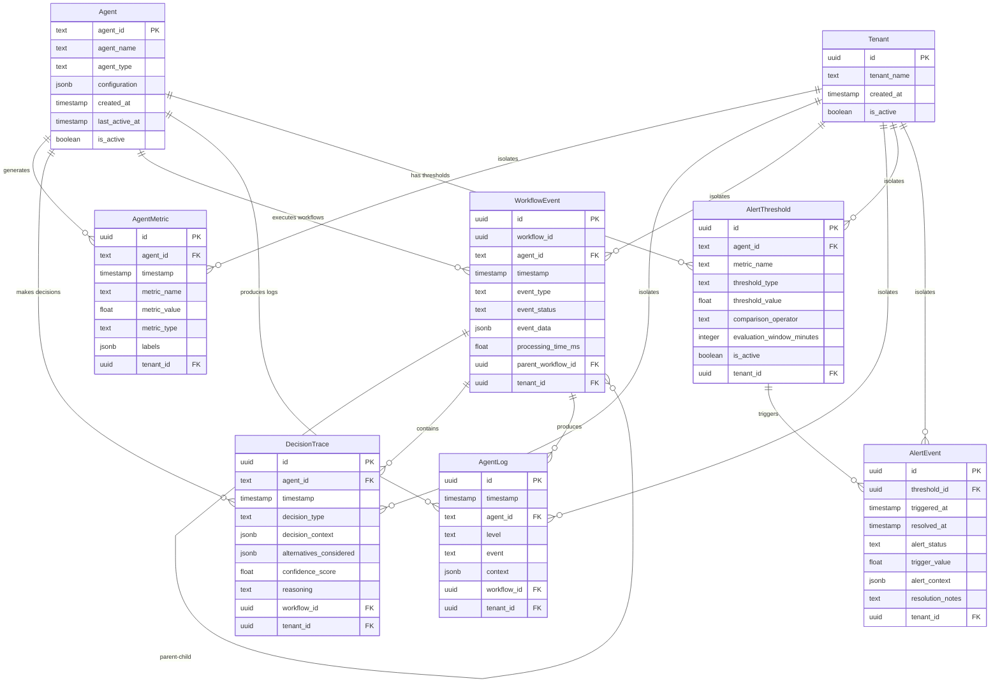

# Observability Framework Data Model

**Created**: 2026-01-14
**Phase**: 1 - Design & Contracts

## Entity Relationships



## Core Entities

### Agent

**Purpose**: Registry of autonomous AI agents in the Penfold system

**Key Fields**:
- `agent_id` (TEXT): Unique identifier for agent (e.g., "email_processor", "meeting_analyzer")
- `agent_name` (TEXT): Human-readable name for dashboard display
- `agent_type` (TEXT): Category of agent ("processing", "analysis", "coordination", "review")
- `configuration` (JSONB): Agent-specific configuration and capabilities
- `is_active` (BOOLEAN): Whether agent is currently operational

**Validation Rules**:
- `agent_id` must be unique across the system
- `agent_type` must be one of predefined types
- `last_active_at` updated automatically when agent operations occur

**State Transitions**:
```
created → active → inactive → archived
```

### AgentMetric

**Purpose**: Time-series performance and health metrics for agent monitoring

**Key Fields**:
- `timestamp` (TIMESTAMPTZ): When metric was recorded (TimescaleDB partition key)
- `agent_id` (TEXT): Reference to monitored agent
- `metric_name` (TEXT): Name of metric ("processing_time_ms", "confidence_score", "memory_usage_mb")
- `metric_value` (FLOAT): Numeric value of the metric
- `metric_type` (TEXT): Type of metric ("counter", "gauge", "histogram")
- `labels` (JSONB): Additional metric dimensions (operation_type, status, etc.)

**Validation Rules**:
- `metric_value` must be finite number (no NaN or Infinity)
- `metric_type` must be one of "counter", "gauge", "histogram"
- `timestamp` cannot be in the future
- `tenant_id` required for multi-tenant isolation

**TimescaleDB Optimization**:
```sql
-- Hypertable partitioned by time
SELECT create_hypertable('agent_metrics', 'timestamp',
                        chunk_time_interval => INTERVAL '1 day');

-- Compression after 7 days
SELECT add_compression_policy('agent_metrics', INTERVAL '7 days');

-- Retention policy for 90 days
SELECT add_retention_policy('agent_metrics', INTERVAL '90 days');
```

**Performance Indexes**:
```sql
CREATE INDEX idx_agent_metrics_agent_time ON agent_metrics (agent_id, timestamp DESC);
CREATE INDEX idx_agent_metrics_name_time ON agent_metrics (metric_name, timestamp DESC);
CREATE INDEX idx_agent_metrics_labels ON agent_metrics USING gin(labels);
```

### DecisionTrace

**Purpose**: Captures agent decision points with context and reasoning for debugging

**Key Fields**:
- `decision_type` (TEXT): Type of decision ("entity_extraction", "project_categorization", "confidence_threshold")
- `decision_context` (JSONB): Input context and data that influenced decision
- `alternatives_considered` (JSONB): Array of alternative options with scores
- `confidence_score` (FLOAT): Agent confidence in decision (0.0-1.0)
- `reasoning` (TEXT): Human-readable explanation of decision logic
- `workflow_id` (UUID): Links decision to broader workflow execution

**Validation Rules**:
- `confidence_score` must be between 0.0 and 1.0
- `decision_context` must contain required keys for decision_type
- `alternatives_considered` must be array with at least one alternative
- `workflow_id` must reference valid workflow

**Decision Context Structure Examples**:
```json
{
  "entity_extraction": {
    "input_text": "Meeting with John about Project Atlas budget",
    "entities_found": ["John", "Project Atlas", "budget"],
    "extraction_model": "spacy_en_core_web_lg",
    "processing_time_ms": 245
  },
  "project_categorization": {
    "email_subject": "Atlas Q2 Review",
    "sender": "john@company.com",
    "content_summary": "Budget review discussion",
    "project_matches": ["Atlas", "Q2-Planning"],
    "confidence_scores": [0.92, 0.34]
  }
}
```

### WorkflowEvent

**Purpose**: Tracks cross-agent workflow execution and timing for performance analysis

**Key Fields**:
- `workflow_id` (UUID): Unique identifier for workflow instance
- `event_type` (TEXT): Type of event ("workflow_started", "stage_completed", "handoff", "workflow_finished")
- `event_status` (TEXT): Status of event ("success", "failure", "timeout", "retry")
- `event_data` (JSONB): Event-specific data and metrics
- `processing_time_ms` (FLOAT): Time spent in this workflow stage
- `parent_workflow_id` (UUID): Reference to parent workflow for nested workflows

**Validation Rules**:
- `event_status` must be one of predefined statuses
- `processing_time_ms` must be positive for completed events
- `parent_workflow_id` must reference existing workflow if specified

**Workflow Tracking Patterns**:
```json
{
  "workflow_started": {
    "workflow_type": "email_processing",
    "trigger_source": "nightly_batch",
    "input_count": 25,
    "priority": "normal"
  },
  "stage_completed": {
    "stage_name": "entity_extraction",
    "entities_found": 12,
    "confidence_avg": 0.87,
    "items_processed": 25,
    "items_failed": 2
  },
  "handoff": {
    "from_agent": "email_processor",
    "to_agent": "project_categorizer",
    "data_passed": {"emails": 23, "entities": 12},
    "handoff_reason": "entity_extraction_complete"
  }
}
```

### AgentLog

**Purpose**: Structured logging for agent operations and debugging

**Key Fields**:
- `timestamp` (TIMESTAMPTZ): When log entry was created (TimescaleDB partition key)
- `level` (TEXT): Log level ("DEBUG", "INFO", "WARNING", "ERROR", "CRITICAL")
- `event` (TEXT): Short description of what happened
- `context` (JSONB): Structured context data for debugging
- `workflow_id` (UUID): Links log entry to workflow for correlation

**Validation Rules**:
- `level` must be one of standard logging levels
- `event` cannot be empty or null
- `context` must be valid JSON object

**Context Structure Examples**:
```json
{
  "operation": "extract_entities",
  "input_size": 1024,
  "execution_time_ms": 234,
  "model_used": "spacy_en_core_web_lg",
  "entities_found": ["John Doe", "Project Atlas"],
  "confidence_scores": [0.95, 0.88],
  "error_details": null
}
```

**TimescaleDB Configuration**:
```sql
-- Hypertable for log data
SELECT create_hypertable('agent_logs', 'timestamp',
                        chunk_time_interval => INTERVAL '6 hours');

-- Faster compression for log data
SELECT add_compression_policy('agent_logs', INTERVAL '1 day');
```

### AlertThreshold

**Purpose**: Configuration for automated agent health and performance monitoring

**Key Fields**:
- `metric_name` (TEXT): Name of metric to monitor
- `threshold_type` (TEXT): Type of threshold ("performance", "error_rate", "resource_usage")
- `threshold_value` (FLOAT): Threshold value that triggers alert
- `comparison_operator` (TEXT): Comparison operator ("greater_than", "less_than", "equals")
- `evaluation_window_minutes` (INTEGER): Time window for threshold evaluation
- `is_active` (BOOLEAN): Whether threshold is currently being monitored

**Validation Rules**:
- `threshold_value` must be positive for most metrics
- `comparison_operator` must be one of supported operators
- `evaluation_window_minutes` must be between 1 and 1440 (24 hours)

**Threshold Examples**:
```sql
-- Processing time threshold
INSERT INTO alert_thresholds (agent_id, metric_name, threshold_type, threshold_value, comparison_operator, evaluation_window_minutes)
VALUES ('email_processor', 'processing_time_ms', 'performance', 30000, 'greater_than', 15);

-- Error rate threshold
INSERT INTO alert_thresholds (agent_id, metric_name, threshold_type, threshold_value, comparison_operator, evaluation_window_minutes)
VALUES ('meeting_analyzer', 'error_rate_percent', 'error_rate', 5.0, 'greater_than', 60);

-- Memory usage threshold
INSERT INTO alert_thresholds (agent_id, metric_name, threshold_type, threshold_value, comparison_operator, evaluation_window_minutes)
VALUES ('relationship_discovery', 'memory_usage_mb', 'resource_usage', 2048, 'greater_than', 5);
```

### AlertEvent

**Purpose**: Records triggered alerts and their resolution for audit and analysis

**Key Fields**:
- `threshold_id` (UUID): Reference to triggered threshold
- `triggered_at` (TIMESTAMPTZ): When alert was triggered
- `resolved_at` (TIMESTAMPTZ): When alert was resolved (null if active)
- `alert_status` (TEXT): Current status ("active", "resolved", "acknowledged", "suppressed")
- `trigger_value` (FLOAT): Value that triggered the alert
- `alert_context` (JSONB): Additional context about alert conditions

**Validation Rules**:
- `trigger_value` must be the value that breached threshold
- `resolved_at` must be after `triggered_at` if set
- `alert_status` transitions must follow valid state machine

**Alert Status State Machine**:
```
triggered → active → acknowledged → resolved
         → active → suppressed → resolved
```

## Data Volume Estimates

**Assumptions**: 5 active agents, 1000 operations/day, 30-day analysis window

**Storage Requirements**:
- **AgentMetric**: ~50 metrics/agent/day → 7.5K records/day → 225K records/month → ~45MB compressed
- **DecisionTrace**: ~200 decisions/agent/day → 30K records/day → 900K records/month → ~180MB compressed
- **WorkflowEvent**: ~100 events/agent/day → 15K records/day → 450K records/month → ~90MB compressed
- **AgentLog**: ~1000 logs/agent/day → 150K records/day → 4.5M records/month → ~900MB compressed

**Total Monthly Storage**: ~1.2GB compressed (~12GB uncompressed)

**Query Patterns**:
- **Real-time Dashboard**: Last 1-hour metrics and events, <2s response time
- **Debugging Queries**: Decision traces for specific workflows, <500ms response time
- **Trend Analysis**: 30-day performance trends, <5s response time
- **Alert Evaluation**: Recent metrics against thresholds, <1s response time

## Performance Targets

### Query Performance
- **Dashboard Queries**: <2 seconds for real-time data visualization
- **Decision Trace Lookup**: <500ms for specific workflow debugging
- **Cross-Agent Correlation**: <1 second for workflow event correlation
- **Alert Evaluation**: <1 second for threshold monitoring

### Storage Performance
- **Metric Ingestion**: >1000 metrics/second sustained
- **Log Ingestion**: >5000 log entries/second burst capability
- **Compression Ratio**: >90% for time-series data older than 7 days
- **Query Concurrency**: 10+ concurrent dashboard users without degradation

## Database Schema Implementation

### TimescaleDB Hypertables
```sql
-- Core observability tables as hypertables
SELECT create_hypertable('agent_metrics', 'timestamp', chunk_time_interval => INTERVAL '1 day');
SELECT create_hypertable('decision_traces', 'timestamp', chunk_time_interval => INTERVAL '1 day');
SELECT create_hypertable('workflow_events', 'timestamp', chunk_time_interval => INTERVAL '1 day');
SELECT create_hypertable('agent_logs', 'timestamp', chunk_time_interval => INTERVAL '6 hours');
```

### Continuous Aggregates for Dashboard Performance
```sql
-- Hourly agent performance summary
CREATE MATERIALIZED VIEW agent_performance_hourly
WITH (timescaledb.continuous) AS
SELECT
    time_bucket('1 hour', timestamp) as hour,
    agent_id,
    avg(metric_value) as avg_processing_time,
    max(metric_value) as max_processing_time,
    count(*) as operation_count
FROM agent_metrics
WHERE metric_name = 'processing_time_ms'
GROUP BY hour, agent_id;

-- Daily error rate summary
CREATE MATERIALIZED VIEW agent_errors_daily
WITH (timescaledb.continuous) AS
SELECT
    time_bucket('1 day', timestamp) as day,
    agent_id,
    count(*) FILTER (WHERE level = 'ERROR') as error_count,
    count(*) as total_logs,
    (count(*) FILTER (WHERE level = 'ERROR') * 100.0 / count(*)) as error_rate_percent
FROM agent_logs
GROUP BY day, agent_id;
```

### Row-Level Security (RLS) for Multi-Tenant Isolation
```sql
-- Enable RLS on all observability tables
ALTER TABLE agent_metrics ENABLE ROW LEVEL SECURITY;
ALTER TABLE decision_traces ENABLE ROW LEVEL SECURITY;
ALTER TABLE workflow_events ENABLE ROW LEVEL SECURITY;
ALTER TABLE agent_logs ENABLE ROW LEVEL SECURITY;
ALTER TABLE alert_thresholds ENABLE ROW LEVEL SECURITY;
ALTER TABLE alert_events ENABLE ROW LEVEL SECURITY;

-- Create tenant isolation policies
CREATE POLICY tenant_isolation_metrics ON agent_metrics
    USING (tenant_id = current_setting('app.current_tenant')::uuid);

CREATE POLICY tenant_isolation_traces ON decision_traces
    USING (tenant_id = current_setting('app.current_tenant')::uuid);

-- Similar policies for other tables...
```

This data model provides a comprehensive foundation for observability while leveraging PostgreSQL + TimescaleDB for optimal performance, multi-tenant isolation, and operational simplicity.